## DPPSS 分类数据 R 分析

之前我们使用进行了简单的一元线性回归分析，现在我们来看一下分组数据，并对分组数据进行下面五类分析:

1.  斯皮尔曼秩序相关 Spearman Rank-Order correlation

2.  卡方 Chi-Square

3.  逻辑斯蒂回归 Logistic regression

4.  方差分析 ANOVA

5.  哑变量回归 Dummy Variable regression

这些模型中有许多涉及不仅仅是连续数据，还有分组数据，除了传统的回归和方差分析 ANOVA 外，还需要使用其它分析方法。在本案例，我们需要确定哪些可控因素和约束会影响到:

1.  交付风险 （**Ship-Risk**）

2.  在检验和测试中发现的缺陷类型 （**Defects-Inspect**）

3.  Pico新一代笔记本电脑的开发准时度（**Sched Ontime**）

4.  对Pico新一代笔记本电脑的客户满意度（**CSat**）

-   shipping risk

-   types of defects found during inspection and testing

-   on-time development of the Pico next generation laptop

-   customer satisfaction of the Pico next generation laptop

    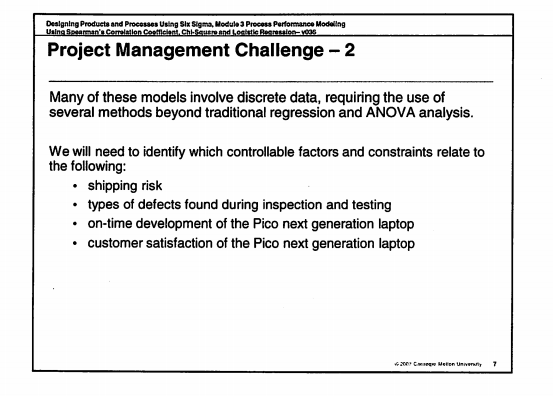

### **现有模型预测的具体结果（变量定义）**

Pico团队历史上收集了许多与产品开发相关的度量，以预测项目的以下结果:

1.  交付风险:1 =低，2=中;3=高（Ship-Risk）

2.  顾客满意度:1 =不满意;2 =边际;3 =公平，4 =好;5=优秀（CSat）

3.  发布后产品的变化度:1 =低;2 =中等;3 =高，4 =很高（Field Volatility）

4.  发布后产品维护工作量:1 =低;2 =中等;3 =高;4 =非常高（Maint）

5.  检查发现的缺陷类型:外观、数据、算法、逻辑（Defects-Inspect）

6.  测试发现的缺陷类型:外观、数据、算法、一致性（Defects-Test）

7.  按进度计划完成:是/否 （Sched Ontime）

8.  交付缺陷密度:发布缺陷数/KSLOC (D/KSLOC)

9.  进度损失:是/否 (Schedule Achievement)

The Pico team historically collected a number of measures related to product development to predict the following outcomes across projects:

1.  shipping risk: 1 = low, 2= medium; 3-high

2.  customer satisfaction: 1 = unsatisfied; 2 = marginal; 3 = fair, 4 =good;= excellent

3.  volatility of fielded product: 1 =low; 2= medium; 3-high; 4 = very high

4.  maintenance effort of fielded product:1 =low; 2= medium; 3=high; 4= very high

5.  types of defects found by inspections: Cosmetic, Data, Algorithmic.Logical

6.  types of defects found by inspections: Cosmetic, Data, Algorithmic.cogical

7.  schedule achievement: Yes/No

8.  delivered defect density: Released Defects/KSLOC

9.  schedule loss: Yes/No

### **关键参数驱动结果**

Pico团队之前使用Y-x树来识别一些关键参数，这些参数可能会驱动性能结果，包括以下内容:

1.  programming language 编程语言在产品中占主导地位:C、C++、Java (**Language**)

2.  average experience of the dev team 开发团队的平均经验水平:低、中、高 (**Experience**)

3.  employee turnover rate 员工流失率:团队的百分比。 (**Turnover**)

4.  requirements volatility during development 产品开发期间的需求变化度:在开发期间更改或添加的所有需求的百分比。 (**Req Volatility%**）

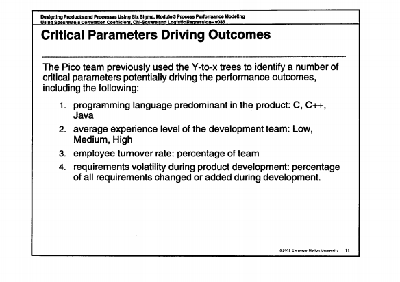

“客户的声音”(VoC)表明，客户的满意取决于产品的及时发布。现在，Pico团队将回顾几个历史的CMMI过程性能模型，以确认团队可否满足本项目这种超压缩的计划。此初步分析将有助于确定是否需要更详细的过程建模和仿真。通过回顾以往的过程性能模型，让管理层可更深入地了解哪些可控因素最重要

## 斯皮尔曼秩序相关 Spearman Rank-Order correrlation

皮尔森 (Pearson) 相关性(在之前的课程中讲授)依赖于连续的数据，但对于有序的数据存在另一种选择:斯皮尔曼相关性。在我们的情况下，Pico团队感兴趣的相关性如下:

-   交付风险 (Ship-risk)

-   客户满意度 (CSat)

-   已部署产品的变化度 (Fielded Volatility)

-   已部署产品的维护工作量 (Maint)

斯皮尔曼相关系数的解释与皮尔森相关系数的解释大致相同，但分析比较的是变量的排名顺序，而不是原始值。下面是minitab命令获得Spearman相关系数(因minitab里面没有Spearman，只有Pearson,所以要进行Spearman，需要先对数据进行排秩)。

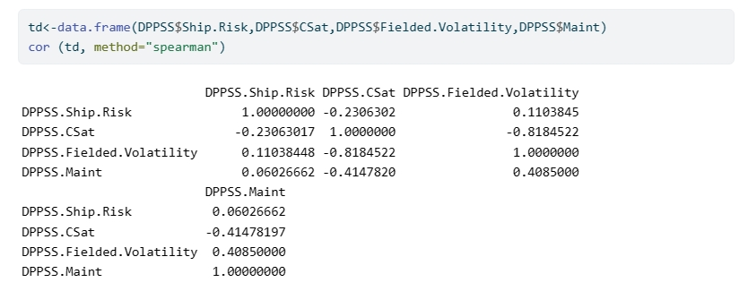

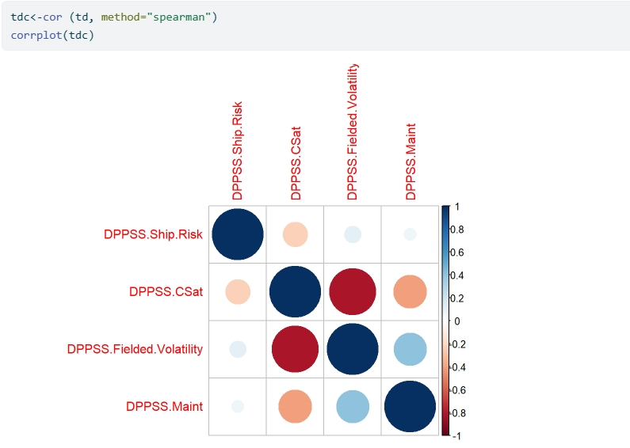

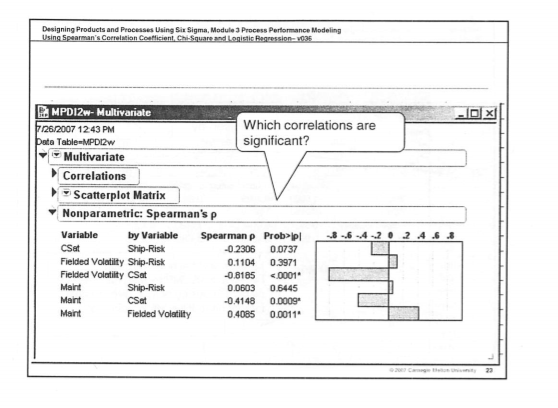

输出结果显示了spearman相关系数及其对每一对的重要性在这个例子中，显著相关是\
“Fielded Volatility”与“CSat”呈负相关\
“Maintenance”与“CSat”呈负相关\
“Fielded Volatility”与“Maintenance”正相关

## 卡方 Chi-Square

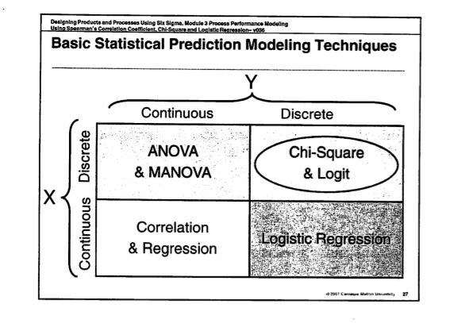

交叉表或列联表的目的是通过检验和测试观察频率来确定变量之间的关系

卡方测试：

-   讨论属性或分类数据之间的任何明显差异

-   是对两个或两个以上的稀疏变量的列联表数据执行的吗

-   反映变量在每个单元格中出现的频率

-   分析预期频率和实际频率

卡方分析的类型包括以下几类:

-   对名义数据进行卡方分析

-   皮尔逊(Pearson) 卡方分析(最常用来确定列联表中的关联)

卡方可能以两种常见的方式支持预测建模

1.  卡方分析使我们能够看到，一个离散因素的知识在预测一个独立的离散结果时是否有用。

2.  通常使用卡方分析来验证数据是否符合一个或多个分布，从而达到预测建模的目的

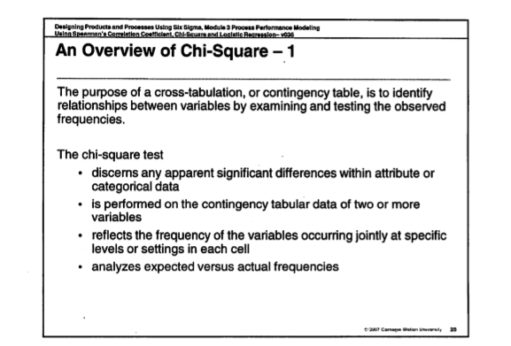

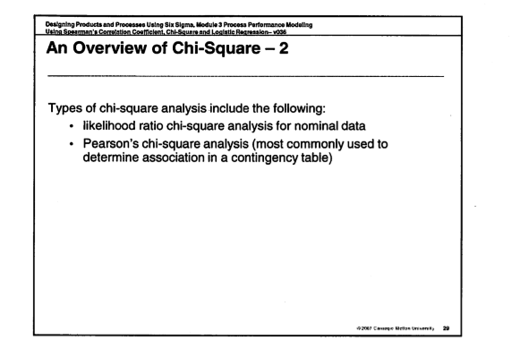

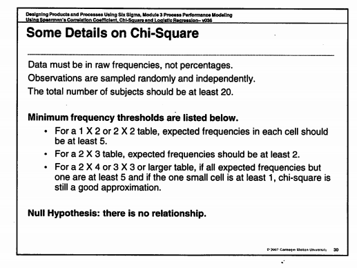

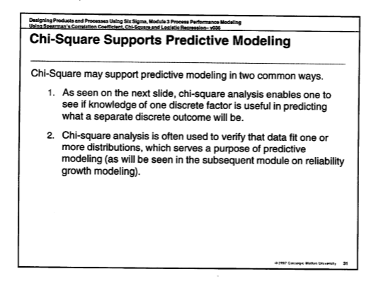

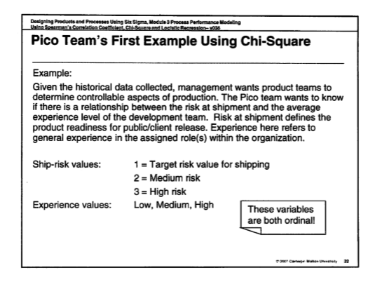

## 例1：交付风险(Ship Risk) 与 经验(Experience) 是否相关

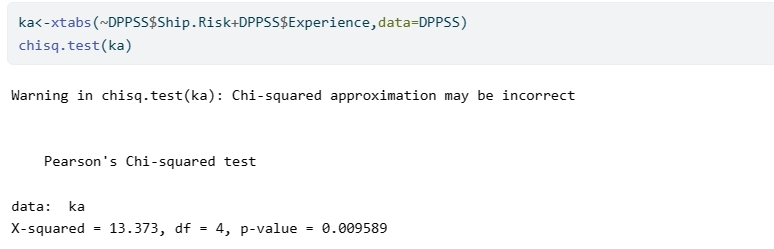

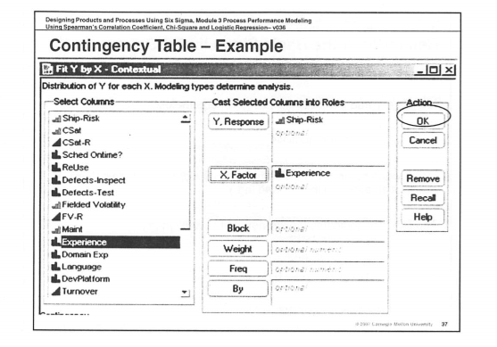

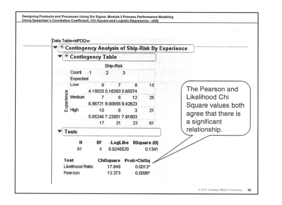

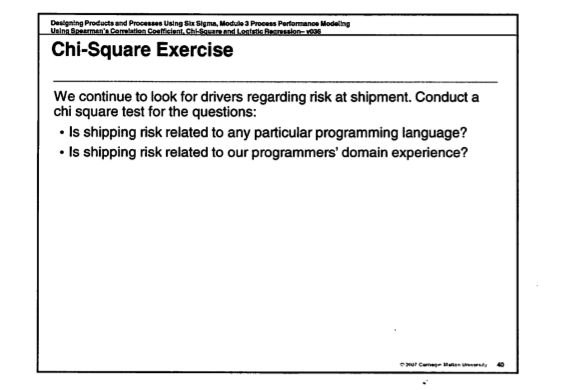

从以上 Pearson , Likelihood P值都很低，可判断 交付风险 Ship-Risk , 经验 Experience 之间有显著关系。 **练习**

-   交付风险 跟 开发语言是否相关？

-   交付风险 跟 开发人员经验是否相关？

-   Is shipping risk related to any particular programming language?

-   Is shipping risk related to our programmers' domain experience?

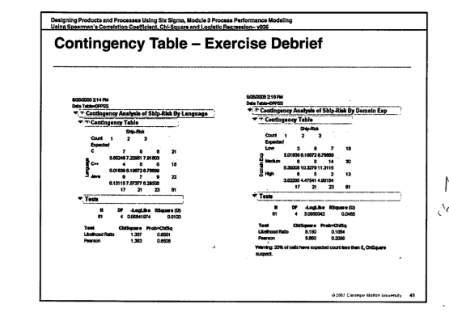

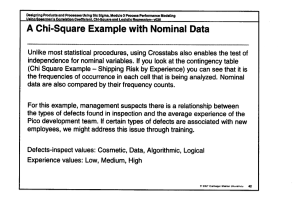

## 例：对名义级数据做卡方检验

-   评审缺陷类型 是否与 经验（高中低）相关

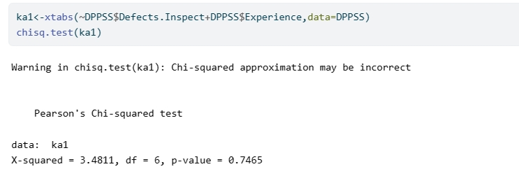

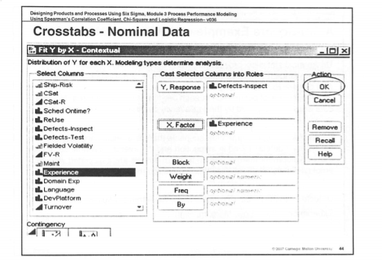

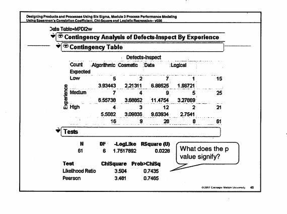

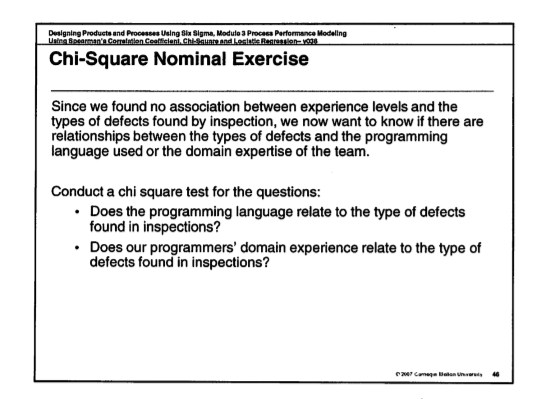

## 逻辑回归

不同于线性模型，逻辑斯蒂模型P(X)落在0-1之间，P(X)模型系数β0 β1是未知，必须通过有效的训练数据估计，其中β0越大，发生事件的概率越大

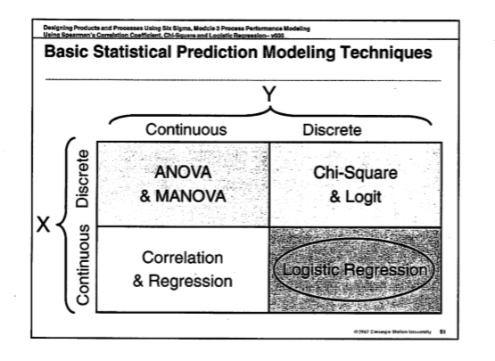

逻辑回归的目的是使用连续的X因素来预测离散(分组)的Y结果。

logistic回归分析包括:

-   名义 (Nominal)：一个名义的Y被预测(e.q。，无次序的分类)

-   顺序 (Ordinal)：预测一个序数Y(例如，有序的分类)

-   二元 (Binary)：预测一个二元的Y(例如Y只有(0/1)两个可能值)

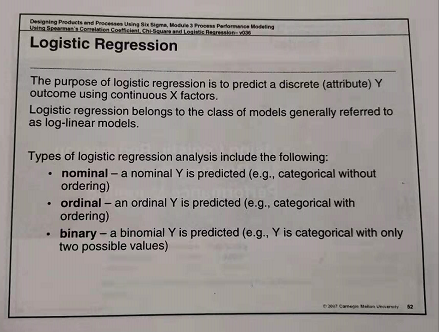

Pico团队预测一个有序的结果：虽然前面的分析考虑了缺陷、员工离职和需求波动之间的关系，但是它只解释了变化的一部分。团队感兴趣的是，Requirements Volatilty%和Parts Availability%是否与客户满意度有直接关系，这些变量会直接影响进度。顾客满意度值:1=非常低，2=低，3=标准，4=高，5=很高

Requirements Volatilty 和 Parts Avail 都是百分比。

以下例子2：探讨 Parts 和 Reuse 对 CSat 的影响\
开始模型中，y = CSat, x =Parts %Reused

\
假设我们想要确定我们的进度成就是否依赖于我们拥有数据的各种因素。我们想要测试员工离职和需求波动对项目进度的影响。部件可用性也会被检查，因为它跨越子流程边界，这使得它成为流程流计时效果的一个很好的代理。

-   按进度计划完成吗? 是/否

-   员工流动率 有改变的团队（百分比）

-   需求变更 需求的变化率（百分比）

-   部分的可用性 零件转移到下一个过程或子过程的比例 （百分比）

总结：分析显示，能否按进度计划完成交付 与员工流失率有关，但与需求变更波动或零件可用性无关。(注意:当你可以使用统计数据时，不要相信直觉。)

这个例子展示了在回归设置中测试效果的一般方法:包括所有感兴趣的因素，然后迭代地丢弃不重要的因素。如果其余因子的显著性发生变化，那么x之间可能存在交互作用。尽管它超出了这个类的范围，但请记住，一个完全指定的模型还将包括交互，这可能会使解释变得复杂，但也可能非常有启发性。我们只看了主要的效果。

= = = =

逻辑回归基本步骤

1.  确定Y和1+ X进行逻辑回归分析。

2.  进行logistic回归分析。

3.  根据相应的p值寻找重要因素。(参见层压工作辅助材料。)

4.  用平方来判断关系的强度。

5.  解释系数和比值比，解释基于1个单位的X因子变化对Y结果变化的比值的影响

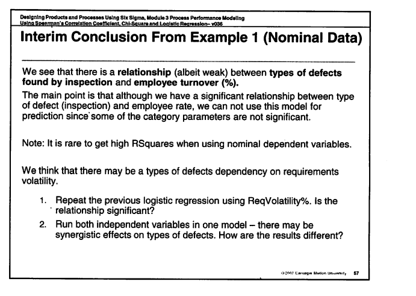

### **例：逻辑回归**

-   评审缺陷类型(Def-Inspect) 与 员工流失率(Turnover) 的关系 (名义）

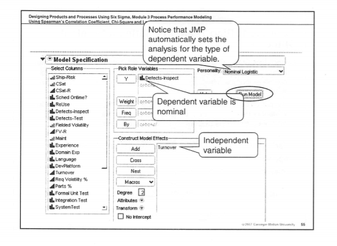

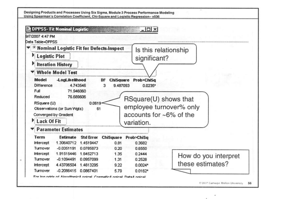

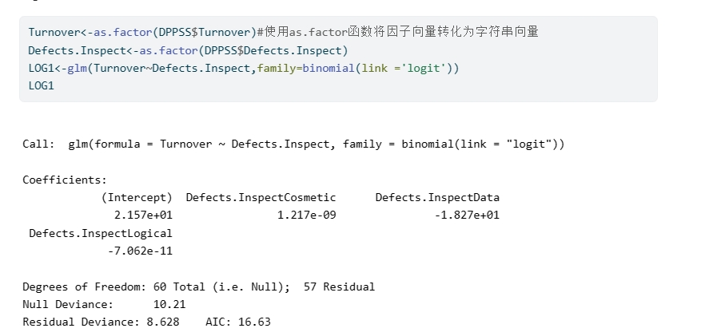

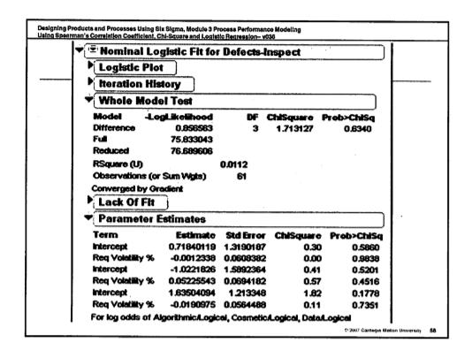

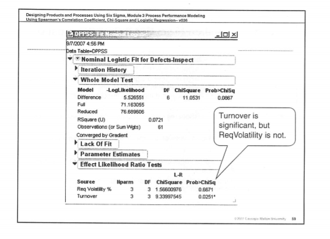

## 方差分析 ANOVA

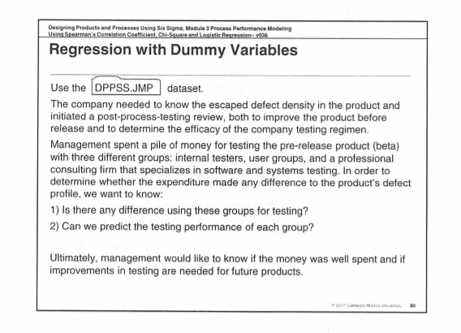

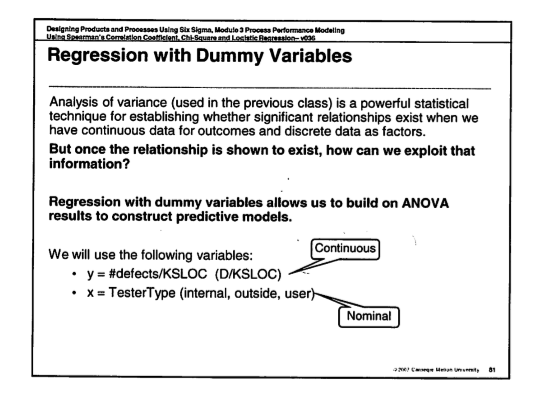

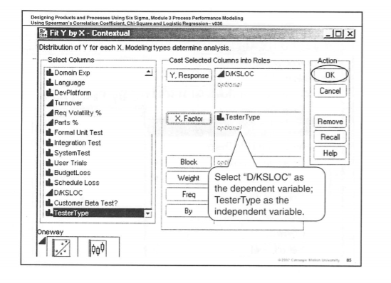

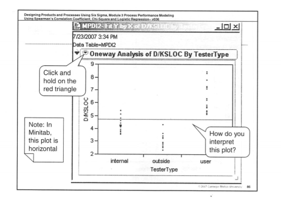

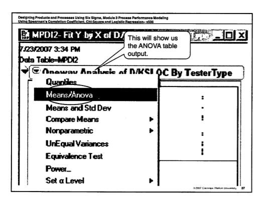

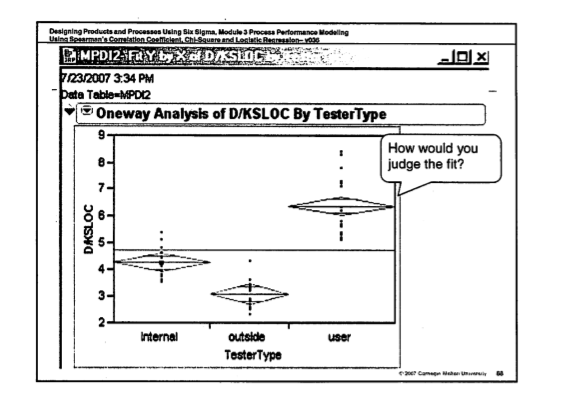

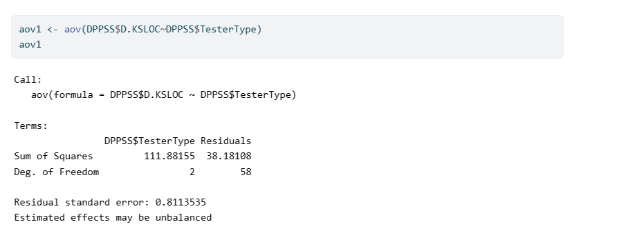

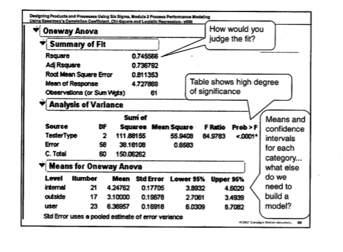

### **例：哑变量 回归**

-   缺陷密度(D / KLOC) 与 测试人员种类(Tester Type) 的关系

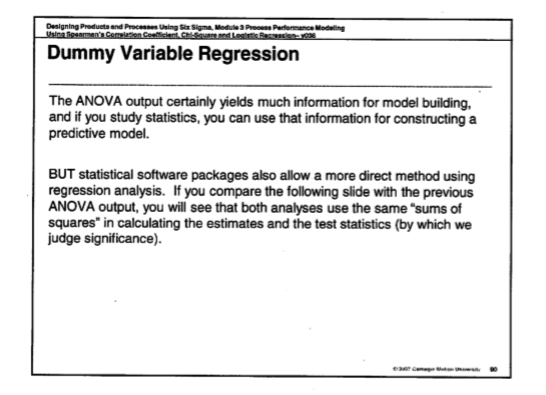

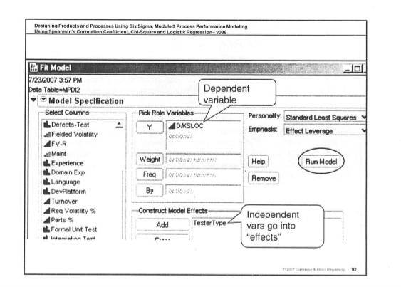

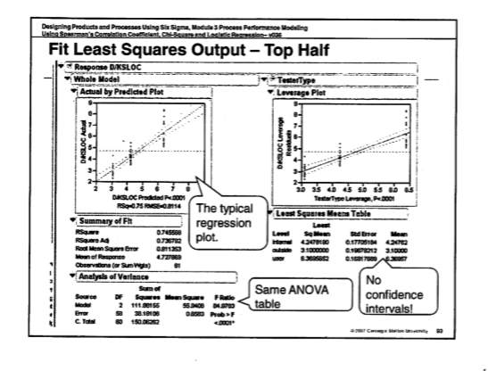

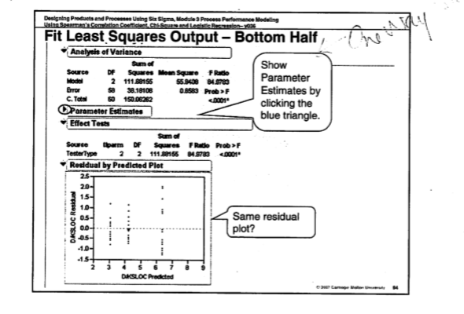

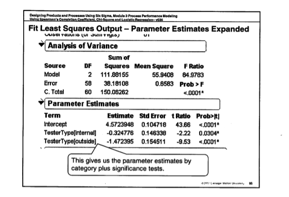

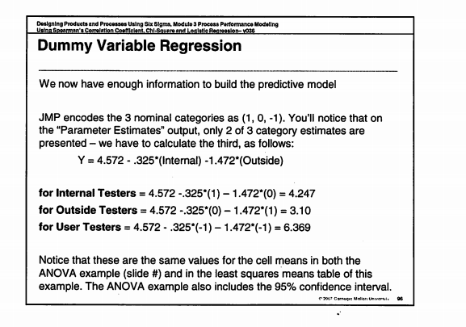

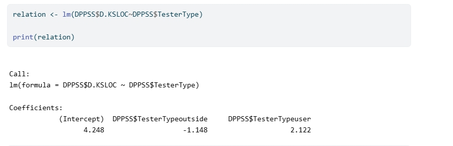

有了ANOVA分析基础 发现确有关系 就可以做哑变量回归

## 哑变量回归 Use Dummy Variable

公司需要了解产品遗漏缺陷密度，并开始进行后处理测试评审，以在产品发布前对产品进行改进，并确定公司测试方案的有效性。管理层为测试预发布产品(beta)花了很多钱，测试对象是三个不同的组:内部测试人员、用户组和专门从事软件和系统测试的专业咨询公司。为了确定支出是否对产品的缺陷有影响，我们想知道:

1.  使用这些组进行测试有什么不同吗?

2.  能否预测各组的测试表现吗?

最终，管理层想知道这些钱是否花得值得，未来的产品是否需要改进

方差分析(ANOVA)是一种强大的统计技术，用于确定当我们有结果的连续数据和作为因素的离散数据时是否存在显著关系。但是一旦这种关系被证明是存在，我们如何利用这种信息建预测模型?

首先，进行ANOVA分析，以确定交付的缺陷密度与参与测试过程的测试人员类型之间是否存在显著的关系。

然后，我们将展示如何在工具中实现相同的模型，以扩展构建回归模型的结果。

注意:在对变量没有透彻了解的情况下，不要随意建立虚拟回归模型。当考虑是否使用方差分析结果时，显著性和适合度(调整后的R - square)应该足够高，以达到我们的目的，使我们能够自信地使用数据来预测未来的结果。

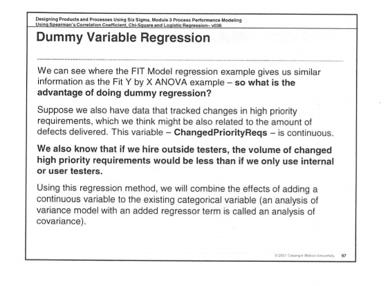

### **例：哑变量 + 连续数据 回归**

-   缺陷密度(D / KLOC) 与 测试人员种类(Tester Type) + 变更申请(ChangePriorityRequests) 的关系 (变更申请是一连续数据）

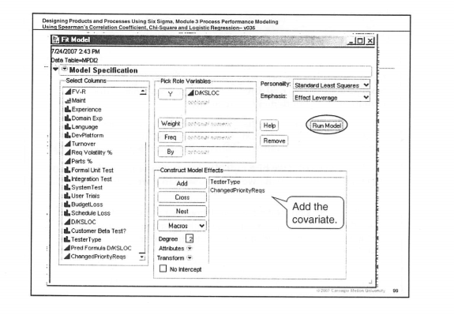

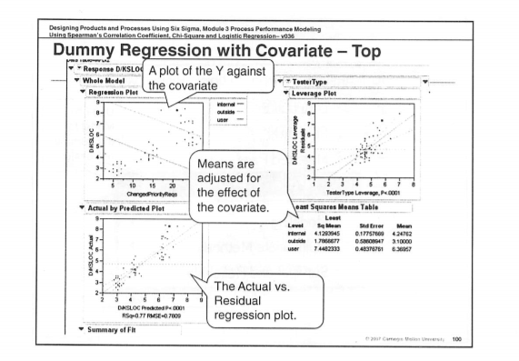

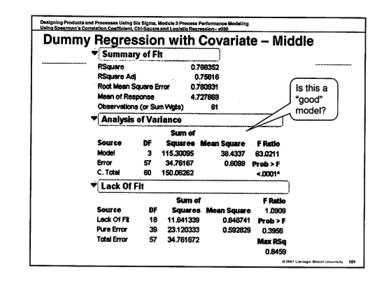

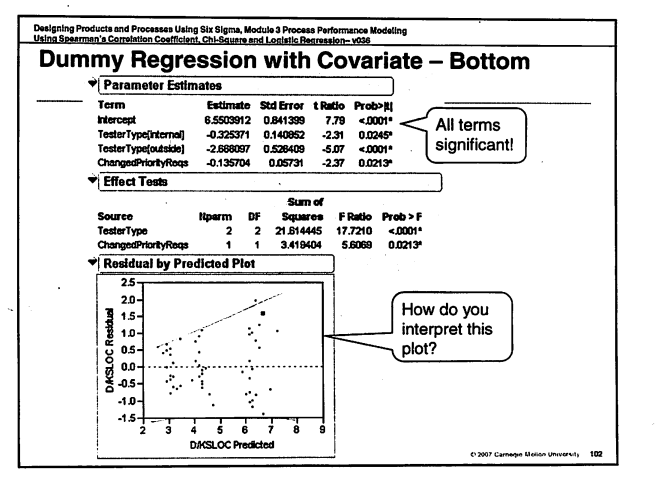

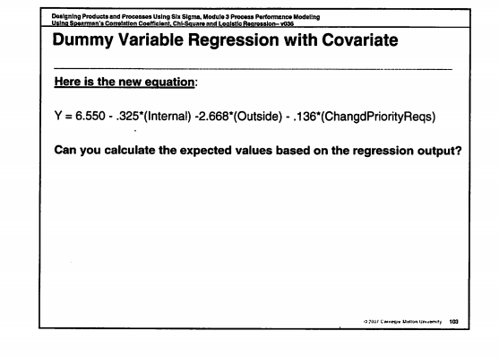

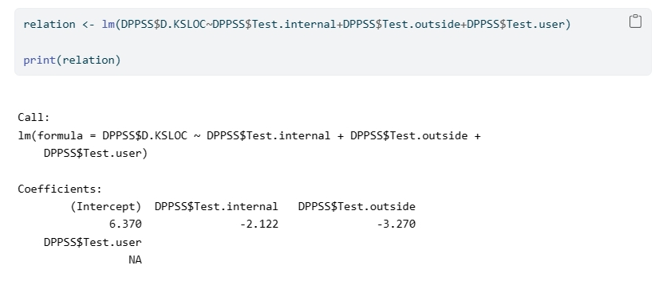

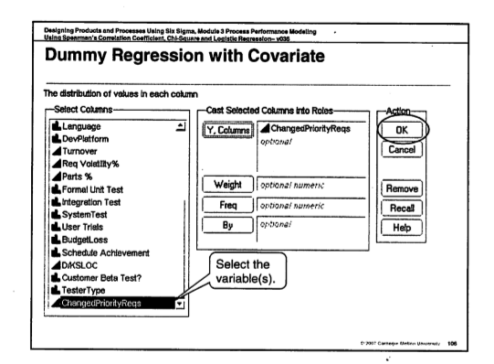

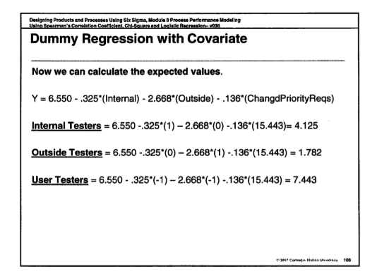

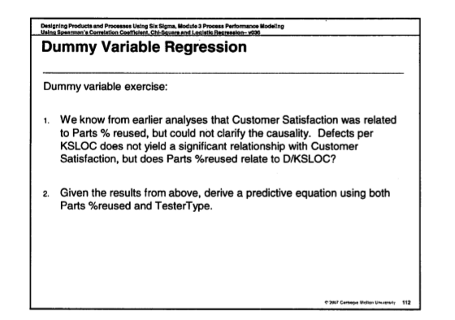
