## M3 控制图CC

下面某月报

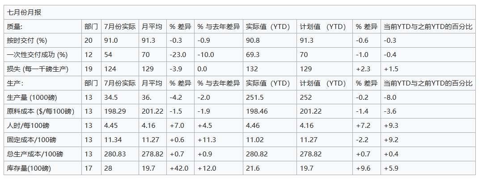\

月报里包括当前7月的数字与上个月比，或与去年7月份比较，或比较累计值等，但是变化百分比有正有负，你看完这个表能了解生产的变化情况吗例如变好还是变差？

客户：看不出来。

我：所以我们有以下原则：

```         
要了解确实的数据的变化，应该有数字本身 
```

但是仅有数据也无法“看”到变化，所以也需要把那些数按顺序画趋势图；比如你看下面这个八七年到八八年，美国国家总贸易逆差每月的数据趋势图，就更好了解美国贸易差这两年的变化。

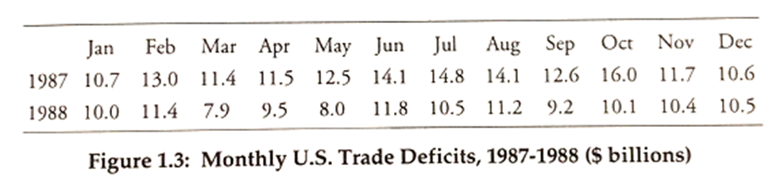

## 建立基线

有数据便可以开始建立公司基线（或者标杆）作为以后参考。你看刚才两年的美国贸易逆差数据有变化吗？\
客户1：有变化，比如中间87年10月份就特别高，后面88年的5月份也特别高，应该是不正常。\
客户2：我看不是，好像是后面那些数比前面低了。\
我：很好，但要判断分析数据有没有变化，很难单靠主观识别，需要有工具帮助

## 噪音还是信号

我：假设一家生产矿泉水的企业，通常一瓶水500毫升，为了确保每次机器装的水不会太多，也不能太少，每一轮生产都会随机抽五个样本，然后记录抽样的均值和范围（最大 - 最小）？下图是过去22 天均值的变化:

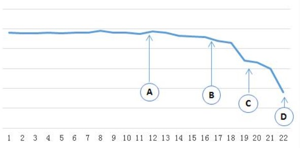

肯定是后面比之前的下跌了，但是如果等到最后D点才行动就太晚了，已经跌了太多，但是在那个点开始有变？

这也是20年代美国电话公司要解决的问题：很多电话线路与设备都埋在地下，调配工作很困难， 如何能尽量减少无用的调配工作？ 公司也利用生产线大量生产电话设备，需要调试生产线的各种设备参数，但工程师发现难以把生产线调试到稳定状态，如果按系数低了调高，或者高了调低，反而会越调越乱。针对这难题，Dr Shewhart （当时在Bell Labs工作）发明了控制图，用来区分是过程的噪音还是信号。你们高中的时候学统计学有听过正态分布吗？\
客户：有印象，但全都还给老师了。

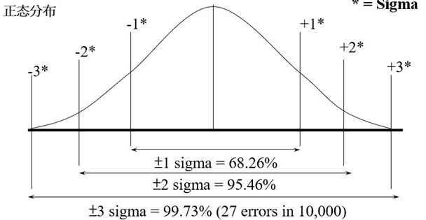

我：上图是正态分布，正负三个标准差包括了99%以上的面积。记得我们前面说过中线极限定理吗？任何分布如果随机抽样够多的话，它的均值就是接近正态分布。所以控制图按样本的平均值的标准差，用方程式计算上限和下限，如果后面有些点超出了上下限范围 （因上下限是按正负三个标准差出来，所以任何后面的点超出这范围，它发生的概率是少于1%。）利用控制图帮我们区分那些波动是噪音，那些波动（异常点）是信号。（想了解各种常用于生产管理的控制图，参考附件）

注意：虽然上面用正态分布来理解为什么选上下三个标准差为控制图上下限，但Shewhart 先生的控制图方法没有规定或假定数据必须是正态分布。

回到两年美国贸易逆差数据，刚才不是说十月份超高吗，但是如果用控制图发现它还是在范围之内。如果我们多看两个月，11月12月，又发现贸易逆差又跌下来

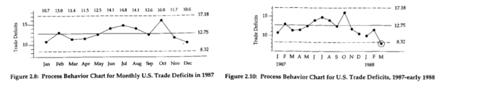

我们继续看，发现三月有异常点，后面在五月份也有异常点。如果我们再看后面月份的逆差数据，看见明显比前面降低。

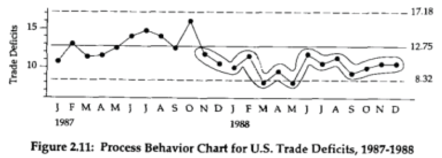

客户：理解了。这个对于我们定基线有什么作用啊？\
我：从刚才贸易差的数据，我们就不能把两年的数据的均值与范围（极差）作为基线，应该是以后面降低后的那些点，才能真正反应当前的水平和分布。

如果不是工业生产，不一定有这么多数据去随机抽样、求均值，怎么办呢？可以用ImR图 (或 XmR)，比如下图就是某个医院做外科心脏手术所花的时间的统计，想看看开心手术的时间是否稳定，因为外科手术特别危险，越长时间那个病人的存活机会就越低，也看到是有异常点。

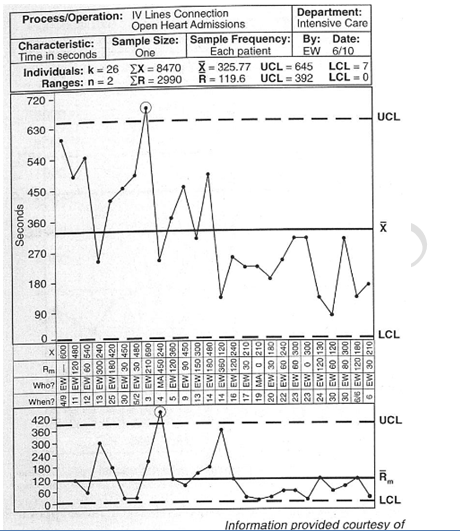

ImR 控制图相关公式，详见附件。

客户：可以用于我们软件开发吗？\
我：是或者不是，比如一些已经进了维护期的产品都很稳定的，你就可以用控制图来识别有没有变化。但是一些全新的过程可能变化很大，可能控制图就不一定适用。但如果你是比如客服收多少投诉，每天都是很稳定、连续的，应该可以用。 下面是两个项目的迭代缺陷密度趋势图， 请问你觉得那个项目的数据可以用统计图？

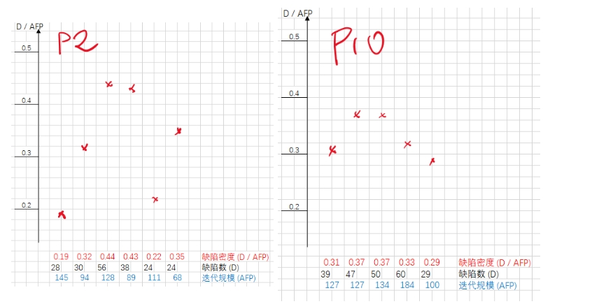

客户：右面 P10 应该可以，左面P2 的数据太散了。\
我：是的， 例如， 你会发现P2 的控制图上下限非常宽， 所以必须首先要知道是什么原因导致，完善后稳定，才可以用控制图。

## 控制图的应用

某企业非常关注交付有没有延误,每月都收集各个部门发生投产延误的次数，除以项目发布投产总数，统计并每月汇报高层。\
从2021年初开始使用控制图，计算上限与下限(0.98 , 0.93)，3月份统计发现系数是0.92，超出了下线范围，改进小组启动根因分析。\
每月的统计数是从7个模块（事业部）汇总来，改进小组利用80/20 原则，识别出贡献最大的头两个模块已占总数之73%，便专门调研这两个模块。 使用问卷，面谈等，找出主因：

1.  新进项目经理较多，对里程碑管理、关闭条件等要求不清楚

2.  项目有点难，和用户沟通效果不佳

对应改进行动：

-   对项目经理的里程碑管理过程进行改进。包括：

1.  培训（讲解项目管理工具的使用，和里程碑管理要求）

2.  考核（明确如果出现里程碑红灯的考核标准）

3.  预防（建立专项沟通小组，对存在进度风险的项目，提醒项目经理尽快推进项目经理或和用户提前沟通准备变更）

我问：效果如何？\
过程改进组长：请看下图 今年到10月份的趋势图，从3月份的低点后面就明显改善了：

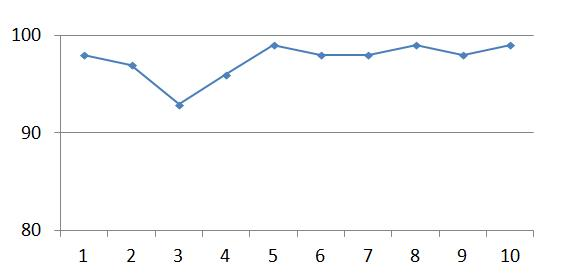

我：建议你用控制图方程式计算，从五月份到现在的统计图。

第二天，过程改进组长展示之前，之后的两个控制图：

下面左图是3月份0.92与之前一年多的控制图 ， 右图是改进后5月份开始的控制图

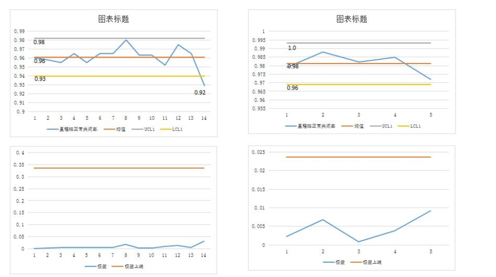

我：从左右控制图看得出改进后的下限从本来的0.93升到0.96。除了画图，也可以计算过程能力指数( Cpk)反映过程能多满足客户要求（Cpk计算公式，详见附件）\
正与你说公司本来要求不能低于0.93（客户要求规格），所以三月份之前的能力指数Cpk = 1.0 但现在过程收窄了， Cpk = (1-0.93) / (1- 0.96) =1.75 上升了。

如果公司因看到提现，也是收窄的规格范围，要求把下限调高到0.96\
你们的指数能力指数Cpk又变回了1.0\
所以Cpk可用来代表过程满足客户要求的能力系数。

过程改进组长：从五月后数据更新的控制图一直都很稳定，没有异常点，是否表示我们就没有在提升的空间，下限0.96已经是最佳状态？\
我：不一定，你三月份分析时，不是说利用二八原则，识别出两个影响最大的板块吗？ 现在你的控制图是把所有板块的总数的控制图， 建议你试试针对那两个影响最大的板块，画他们的控制图看看。 有机会能看到一些异常点。\
第二天，过程改进组长： 确实看到有较大的波动，但还没有超出上下限，我们会继续观察。

以上实例帮我们了解：

### **1. 基线**

从历史数据得出基线范围能帮助我们区分后面哪些波动是自然噪音，哪些是信号。 信号表示过程可能有基本变化，需要更新基线。控制图帮助我们能做好这区分。

### **2. 过程能力(Process Capability)**

-   识别

    -   过程的声音 (过程的自然波动范围)

    -   客户的声音 (客户规格上限下限)

-   计算过程能力指数( Cpk)反映过程能多满足客户要求

### **3. 细分**

-   不仅仅看总的综合的统计图

-   从组成主墙的统计图可能发现异常点信号

(详见附件有另一个细分例子)

## 总结

以上是如何利用统计图帮继续改地过程的典型案例, 所以不要误以为 控制图的目的只是为了控制不要发生异常点 忽略了也要利用异常点看看过程有显著变化，是否启动根因分析，并采取纠正措施。

很多公司制定改进目标还是依赖主观判断，定一个“合理"提升百分比, 使用统计图后便可以有当前过程的基线范围作参考，制定有具体范围的提升目标。

# 附件

## 如何画ImR控制图

1/ 计算单值(X)平均数 (X-bar)\
2/ 计算移动极差(mR moving Range)均值\
3/ 利用以下方程式，计算X的上下限

UNPL=X-bar+(2.66\*mR均值)

:   LNPL=X-bar -(2.66\*mR均值)

4/ 利用以下方程，计算移动极差的上限

URL=3.27\* mR均值

5/ 如果X或mR有超出范围，表示有过程变化的信号，过程不稳定\
6/ 也不应该有连续8个或以上的点都持续提升，因这种发生的概率低于百分之一

[Note]{.underline}:

UNPL=Upper Natural Process Limit

:   LNPL=Lower Natural Process Limit

:   URL=Upper Range Limit

[例子]{.underline}:

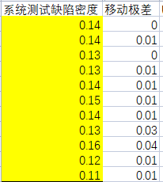

1/ 计算单值(X)平均数 (X-bar) =0.135 \[ (0.14+0.14+...+0.11)/11 \]\
2/ 计算移动极差(mR moving Range)均值 如第一移动极差为0.14-0.14= 0; 第二移动极差为0.14-0.13= 0.01;10点的均值 = 0.0128\
3/ 计算X的上下限：用上面公式 UCL=0.135+2.66\*0.0128=0.17 LCL=0.135-2.66\*0.0128=0.10\
4/ 计算移动极差的上限 用上面公式 UCL=3.27\*0.0128=0.042 LCL =0\
5/ 下面2图加上这些上下限与平均线：

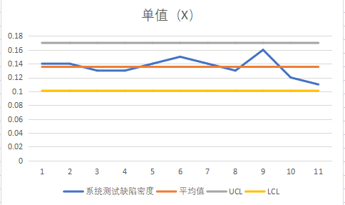

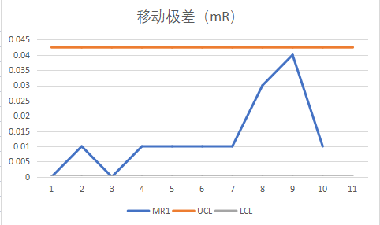

## 各种控制图

生产线用连续数据的控制图有两部分：

-   均值或中位数

-   标准差或者范围

两个图都要看。通常一些数据本身的值有异常点的话，很可能它的标准差变化也会有异常点。\
下面就是各种对连续数据的控制图方法，大部分都是按抽样样本的大小制定，比如抽样的样本数大于10，我们就可以用平均值和标准差来做控制图：

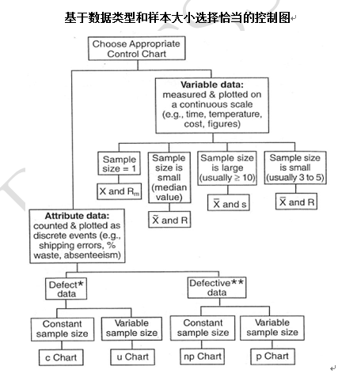

## 过程能力(Process Capability)

过程能力反应能否满足客户要求：

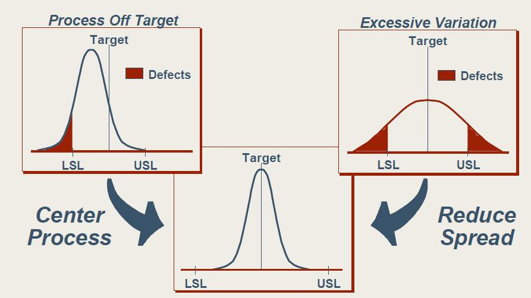

中间的图就是客户的声音，USL和LSL是客户要求的规格上下限，右上面图就代表过程分布太宽，只有中间部分能满足客户规格要求，左图虽然过程变化范围满足，但偏离了，也不能完全满足客户要求。下图看到过程的范围是不能完全满足客户的规格范围要求:

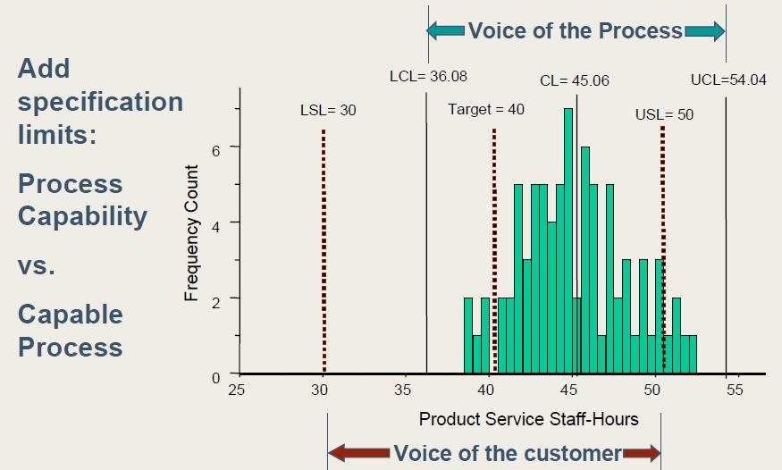

以下方程式可以计算过程能力指数，这个指数越大就代表过程也是中间和没有偏移

$C_p = \cfrac{USL - LSL}{6 \sigma}$不考虑是否偏移，只考虑分布范围

如果考虑偏移，计算$C_{pk} = Min [ \cfrac{USL - \mu}{3 \sigma} , \cfrac{\mu - LSL}{3 \sigma} ]$(选其中最少值)

## 细分例子

过程的分布柱状图也可以帮我们细分找出主要原因，比如，下图右边这种柱状图表明这个分布可能有两个组成：

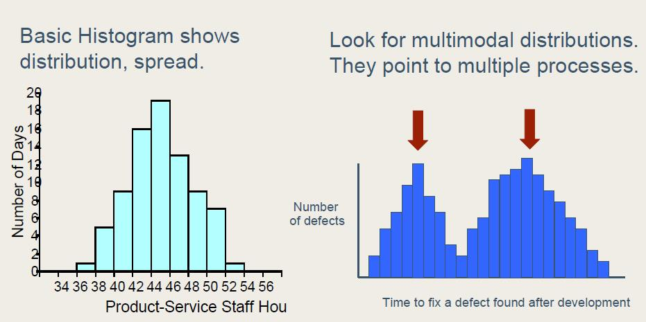

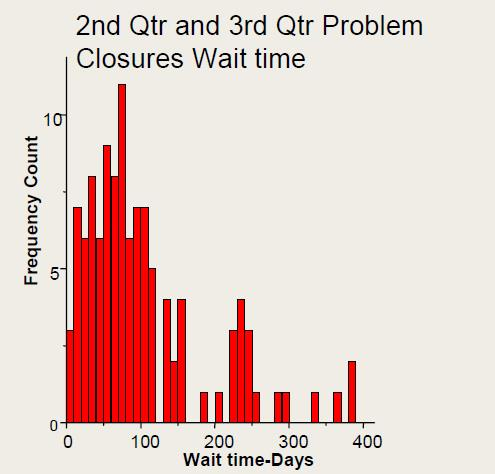

上图是关于客户的等待时间是多少天，可以看到150天以下和以上很可能是两个不同过程，所以我们分析的时候需要按这种细分，控制图也可以帮我们细分。

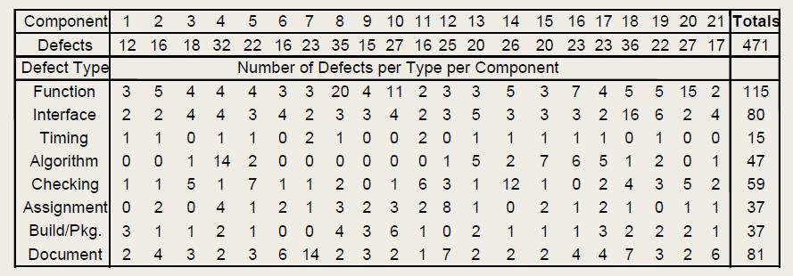

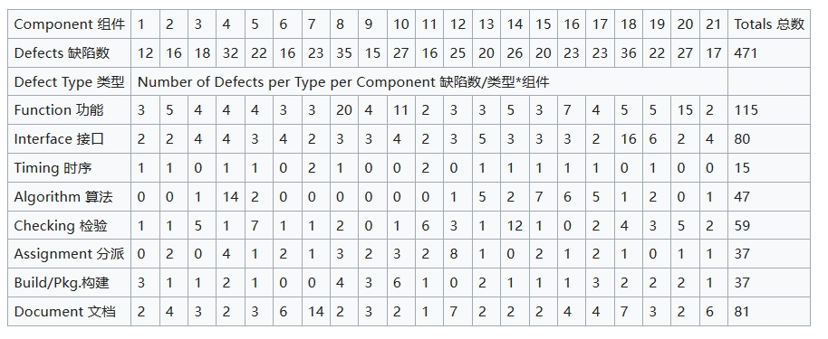

比如上图，某产品有21个组件，统计了每个组件的缺陷数，如果只是看总缺陷数的分布，平均在22.4，看不出有什么显著变化，没有异常点，但是如果按缺陷的8个缺陷种类，画成8个控制图（下图），就很明显看到有很多异常点：

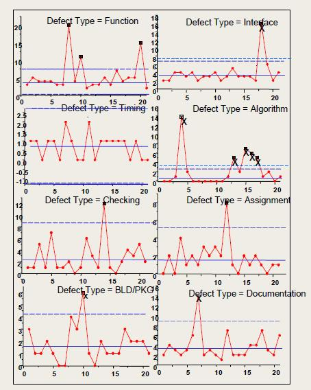
