# MPM CAR HM 高成熟度辅导

# MPM 5.1

Use statistical and other quantitative techniques to ensure that business objectives are aligned with business strategy and performance. 使用统计与其他量化技术来确保业务目标与业务战略和性能保持一致

### **例一**

错误：Our senior management team determines business objectives by brainstorming at their annual management retreat.

正确：Senior management annually evaluates business objectives to ensure they are aligned with business strategies. Business objectives are compared to actual process performance results to ensure that they are realistic and are prioritized based on ability to win new business, retain existing clients, and accomplish key business strategies. Process performance measures are revised as needed to align with the QPPOs.

错误：我们的高级管理团队在年度管理会议上通过头脑风暴来确定业务目标。

正确：高级管理层每年评估业务目标，以确保它们与业务策略保持一致。将业务目标与实际的流程性能结果进行比较，以确保它们是现实的，并根据赢得新业务、保留现有客户和完成关键业务策略的能力来确定优先级。根据需要修改过程性能度量，以与QPPOs保持一致。

# MPM 5.2

Analyze performance data using statistical and other quantitative techniques to determine the organization ' s ability to satisfy selected business objectives and identify potential areas for performance improvement. 使用统计与其他量化技术来分析性能数据，以确定组织实现选定的业务目标的能力，并识别潜在的性能改进领域

### **例一**

错误：Since we were able to meet last year’s business objectives, management decided to improve the goals for this year by 10%.

正确：Since process performance shortfalls severely limit our ability to pursue our business objectives, we take them very seriously. We compare process performance to our QPPOs and look for shortfalls.We perform these analyses using our PPBs, process simulations, and PPMs.

错误：由于我们能够完成去年的业务目标，管理层决定将今年的目标提高10%

正确：由于流程性能的不足严重限制了我们实现业务目标的能力，所以我们非常认真地对待它们。我们将流程性能与我们的QPPOs进行比较，并寻找不足之处。我们使用PPBs、流程模拟和PPMs执行这些分析。

### **例二**

错误：Annually we ask everyone to brainstorm innovative ideas that could improve the organization’s performance

正确：We identify potential improvement areas based on our analysis of process performance shortfalls using PPBs, process simulations, and PPMs. We document the rationale for the improvement areas, including references to the applicable business objectives and process performance data.

错误：每年，我们都要求每个人集思广益，提出创新的想法，以提高组织的绩效

正确：通过使用PPBs、过程模拟和PPMs分析过程性能不足，我们确定了潜在的改进领域。我们记录了改进领域的思路/原因，包括与业务目标和流程性能数据的关系。

### **例三**

错误：We use our PPBs to statistically manage our Business Objectives

正确：We monitor our QPPOs against performance data. We periodically compare the QPPOs to the aligned business objectives to understand the overall impact of aligned QPPOs on the business objectives. We analyze process performance using PPBs, process simulations, PPMs, and other statistical and quantitative techniques. Based on this performance analysis, our Business Objectives (and aligned QPPOs) may be adjusted, or new Business Objectives (and associated QPPOs) may be added.

错误：我们使用PPBs来统计管理我们的业务目标

正确：我们监控性能数据，对比 QPPOs。我们也定期比较QPPOs与对应的业务目标，以了解QPPOs对业务目标的总体影响。我们使用PPBs、过程模拟、PPMs和其他统计和定量技术分析过程性能。基于此性能分析，我们可能会调整业务目标(和QPPOs)，或新增业务目标(和相关的QPPOs)。

# MPM 5.3

Select and implement improvement proposals, based on the statistical and quantitative analysis of the expected effect of proposed improvements on meeting business, quality and process performance objectives.对改进建议实现业务目标,质量和过程性能目标的预期效果进行统计与量化分析，并依据统计与量化分析结果选择和实施改进建议

### **例一**

错误：Put the process and technology improvement proposals in a spreadsheet, think about each one, and tag with a plus if we think it will improve or a minus if we think it will decrease quality and process performance.

正确：Collect improvement proposals and analyze for costs, benefits, and risks. Select those that will be piloted. Document the results of analyses and selection. PPMs may be used to predict effects of the change to the process, the potential benefits, evaluate side effects, and evaluate the effects of multiple interrelated improvement proposals.

错误：将流程和技术改进建议放在一个电子表格中，考虑每一个，如果我们认为它会改进，就用加号标记;如果我们认为它会降低质量和流程性能，就用减号标记。

正确：收集改进建议并分析成本、收益和风险。选择那些将要试点的项目。记录分析和选择的结果。PPMs可用于预测过程变更的效果、潜在的好处、评估副作用，以及评估多个相互关联的改进建议的效果。

### **例二**

错误：Identify improvements that seem to be “out of the box” and look like they will increase quality and process performance.

正确：Actively seek, both inside and outside the organization, innovations to improve processes and product technologies and analyze them for possible inclusion, predicting cost on benefits(using PPMs). Use PPMs and PPBs to analyze the OSSP and identify areas or targets of opportunity for change. Submit improvement proposals for changes that are predicted to be beneficial. Select those to be piloted.

错误：确定那些看起来是“现有可立马使用”的改进，并且看起来会提高质量和过程性能。

正确：积极寻求组织内外的创新，来改进流程和产品技术，并分析在哪里可以包含，预测效益成本(使用PPMs)。使用PPM和PPB来分析标准过程OSSP，并确定变更机会的领域或目标。建议预期有益的变更。选择要试点的项目。

### **例三**

Improvements are proactively identified, evaluated using statistical and other quantitative techniques, and selected for deployment based on their contribution to meeting quality and process performance objectives.

错误：Improvements that appear to help us meet our goals are selected.

正确：The improvements which will contribute most to achieving the organizations objectives, provide the best ROI and most desirable impact, and can be accomplished with available resources will be chosen.

使用统计和其他量化技术对改进进行主动识别和评估，并根据它们对满足质量和过程性能目标的贡献选择部署。

# MPM 4.1

错误：Write down quality and process performance objectives such as improve cycle time, quality, and the percent of improvement we want.

正确：These objectives will be derived from the organization’s business objectives and will typically be specific to the organization, group, or function. These objectives will take into account what is realistically achievable based upon a quantitative understanding (knowledge of variation) of the organization’s historic quality and process performance. Typically they will be SMART and revised as needed

错误：写下质量和过程绩效目标，如改进周期、质量和我们想要到改进的百分比

正确：量化目标来自组织商业目标，通常针对组织的。目标基于组织过去的质量和过程绩效的量化理解（差异的知识），而且考虑是否可实现。通常符合SMART原则并不断修订。

# MPM 4.2

错误：Provide definitions for the measures and update as necessary.

正确：Select measures, analyses, and procedures that provide insight into the organization’s ability to meet its objectives and into the organization’s quality and process performance. Create/update clear unambiguous operational definitions for the selected measures. Revise and update the set of measures, analyses, and procedures as warranted. In usage, be sensitive to measurement error. The set of measures may provide coverage of the entire lifecycle and be controllable.

错误：提供度量项的定义并按照需要更新。

正确：选择度量项、分析方法和程序，以展示满足目标的能力以及组织质量和过程绩效。为所选度量项创建/更新清晰的操作定义。修订或更新度量项、分析方法和程序。使用中对度量错误敏感。度量集可覆盖整个生命周期并可控。

# MPM 4.3

错误：Store measures in our spreadsheet repository on a periodic basis indicating the end date of the period they represent and baseline them in our CM system

正确：Baselines will be established by analyzing the distribution of the data to establish the central tendency and dispersion that characterize the expected performance and variation for the selected process/subprocess. These baselines may be established for single processes, for a sequence of processes, etc. When baselines are created based on data from unstable processes, it should be clearly documented so the consumers of the data will have insight into the risk of using the baseline. Tailoring may affect comparability between baselines.

错误： 周期性存储和展示度量数据并在配置库建立基线

正确：根据数据分布建立基线，以建立集中趋势和分布，为选择对过程/子过程刻画期望的绩效和变异。基线可围绕单个过程或一系列过程。如果基线不基于稳定过程的数据，需要让使用者知道风险。裁减会影响基线之间的兼容性。

### **Scenario 1 (PPB): Un-Gestalt/ 错误例子**

We have performance baselines on a variety of factors. For example, we know that we have the following average defect density (defects per 10 KSLOC) entering System Test:

-   14.35 algorithm defects

-   13.20 stack overflow defects

-   We focused most of our effort on the algorithm defects using pareto analysis, not realizing …

我们有大量因子的过程绩效基线。比如，我们知道有以下缺陷密度的均值（万行代码缺陷数）

-   算法缺陷

-   堆栈溢出缺陷

-   我们使用柏拉图分析主要聚焦算法缺陷。

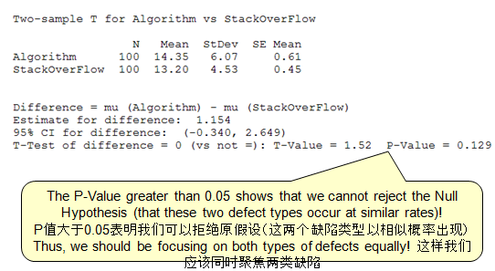

### **Scenario 1 (PPB): Gestalt/ 正确例子**

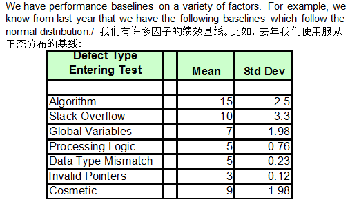

Knowing the distribution of each performance baseline, we are able to confidently assess whether we have real “differences” to act upon or not. We use ANOVA to assess true differences!

知道每个绩效基线的分布，我们有信心评估，我们是否有真正的“差异”要应对或不应对。 我们使用方差分析评估真正的差异。

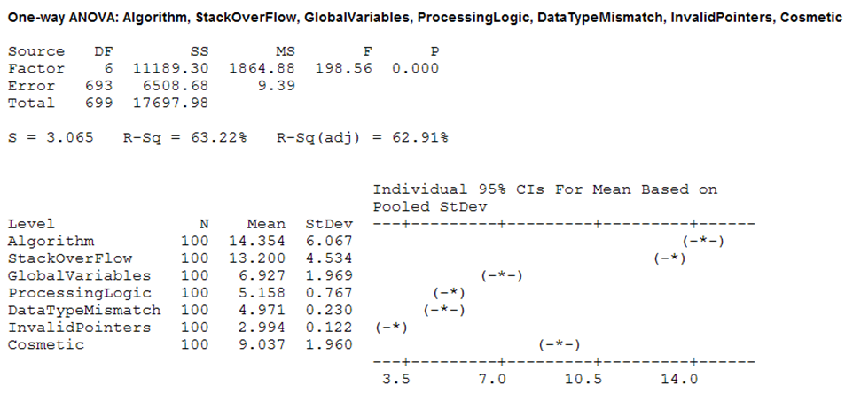

# MPM 4.4

错误：We have historical productivity and defect injection/detection rates by phase which we update periodically and include in reports.

正确：Rather than just a point estimate, PPMs will address variation in the prediction. PPMs will model the interrelationships between subprocesses including controllable/uncontrollable factors. They enable predicting the effects on downstream processes based on current results. They enable modeling of a PDP to predict if the project can meet its objectives and evaluate various alternative PDP compositions. They can predict the effects of corrective actions and process changes. They can also be used to evaluate the effects of new processes and technologies/innovations in the OSSP.

错误：我们有历史生产率和按阶段缺陷注入/检测率，我们周期性更新并在报告中体现

正确：不同于点估算，PPMs致力于预测的差异。PPMs在子过程之间建立联系的模型，包括可控/非可控因素。它们确保基于当前的结果预测下游过程的效果。它们确保一个pdp的建模以预测，项目能够满足目标的要求并评估各种可选的PDP组合。它们能够预测纠偏措施和过程变更的效果。它们能够被用于评价OSSP中新过程和技术革新的效果。

### **Scenario 2 (PPM): Un-Gestalt/ 错误例子**

We are using both COCOMO and SLIM for our initial project forecasting. These models have predictive value and may be used by answering a list of questions We do our very best with these models to give them the best starting point as possible. We also have an escaped defect model that uses the historical average defects inherited, injected and removed by phase. Even with these models, we still seem to have plenty of surprises in cost, schedule and quality!

我们使用COCOMO和slim做项目预测。这些模型有预测值，可用于回答一些列问题。 我们竭尽所能采用这些模型 我们有缺陷泄漏模型，按阶段使用历史缺陷，引入的、注入的和消除的。 即使使用这些模型，我们也在成本、进度和质量上有很多失控。

### **Scenario 2 (PPM): Gestalt/正确例子**

We have enriched our detailed process maps from CMMI ML3 to include executable process models that possess information on cycle times, processing times, available resources, sub-process costs and quality We have also identified the key process handoffs during the project execution in which exit and entrance criteria are important! At these handoffs, we have process performance models predicting the interim outcomes. They will form a pact governing the process handoff and provide leading indicators of problems with outcomes.

我们从CMMI ML3提升详细的过程图，以包括可执行过程模型，处理周期时间、处理时间、可获得资源、子过程成本和质量。 我们也在项目执行中识别主要过程切换，进入和退出标准很重要。 在这些切换，我们用过程绩效模型预测中间输出。它们形成监控过程切换的协议并提供输出问题的主要指标。

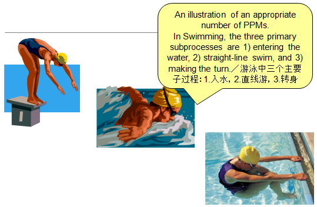

Next, we identify controllable factors tied to earlier sub-processes that may be predictive of one or more of the outcomes (interim and final) we need to predict

\
We then decide what type of data our outcome (Y) is and what type of data our factors (x) are.

Using the data types, we can then begin to identify the statistical methods to help with our modeling. (See next slide)

下一步，我们识别联系到之前子过程的可控因素，可预测一个或更多的输出（中间或最终的）。我们决定我们输出（y）是什么类型数据，并且因子（x）是什么类型数据。使用数据类型，我们开始识别统计方法，以辅助我们的建模。

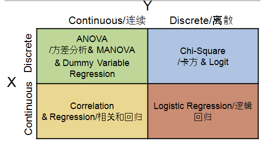

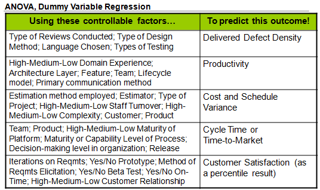

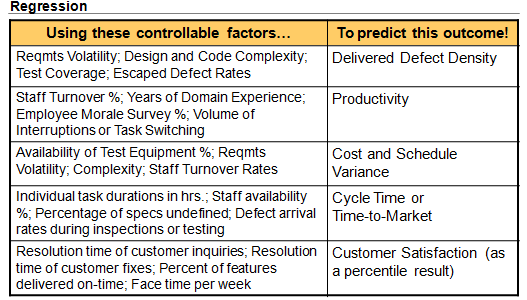

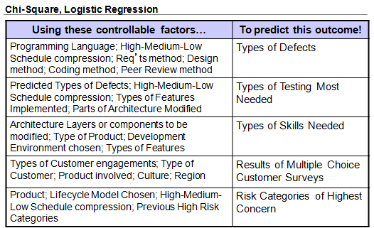

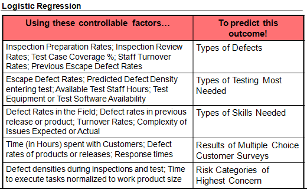

Recently, we conducted a regression analysis to develop our statistically-based process performance model predicting Defect Density. As will be seen on the next slide, the regression model provides rich information about the role of the controllable x factors (Requirements Volatility and Experience) in predicting the Y outcome (Defect Density) In turn, this will provide management with rich information on how to be pro-active in changing predicted high levels of Defect Density to acceptable lower levels!

最近，我们执行回归分析来开发基于统计的过程绩效模型预测缺陷密度。下页可见，回归模型提供来关于可控因子x的大量信息（需求扩散和经验），用于预测Y输出（缺陷密度）。所以，这为管理提供了大量主动性信息，提升缺陷密度预测的精细度。

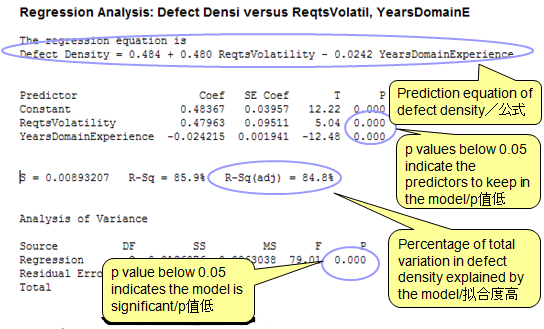

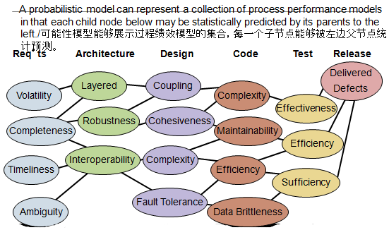

# MPM 4.X Establish Performance Baselines and Models 建立过程基线和模型

错误：The aforementioned data and models characterize OSSP performance.

正确：Central tendency and variation are the cornerstones of our implementation. Our baselines and models incorporate our understanding of these, allow us to understand risks in our organizations and its projects, and allow us to create and execute effective strategies to mitigate and manage risks. We have baselines and models at both the organization and project levels, as appropriate

错误：大家可从历史数据和模型判断公司过程(OSSP)的性能绩效

正确：中间趋势（平均值）和偏差是我们实施的基本。我们基线和模型整合了我们对这些的理解，允许我们在组织和项目中理解风险，并允许我们创建和执行有效的策略缓解和管理风险。按需要，我们会有组织和项目级基线和模型。

# CAR 2.1

错误：Select first ten defects/problems on the list

正确：Outcomes are selected for further analysis based on factors such as clustering and analysis of the clusters of similar outcomes including impact to the project’s objectives, predicted ROI, etc. PPMs may be used in the prediction of impact, calculation of cost and benefits, ROI, etc.

错误：在列表中选择前十个缺陷/问题

正确：挑选那些结果进一步分析。例如：聚类，分析会影响到项目的目标/结果的聚类，预测的投资回报率，也可利用PPM 帮助我们做影响的预测，成本和效益的计算，ROI, 等.

# CAR 4.1 (CAR 3.2 2.2)

错误：Perform causal analyses on the selected defects and problems using Fishbone diagrams. The analysis is qualitatively driven. Propose actions to address the identified causes.

\
正确：

-   analysis of PPBs and PPMs to help identify potential sources of outcomes (positive and negative)

-   causal analysis meetings with the involved parties

-   formal root cause analysis.

-   The analysis is both quantitative and qualitative.

Actions are proposed to not only address the outcome but also to correct the root cause and prevent reoccurrence or incorporate best practices into processes

错误：使用鱼骨图对选定的缺陷和问题进行因果分析。基于定性/主观头脑风暴的分析，并对应原因的解决行动。

正确：

-   PPB / PPM 分析，以帮助识别潜在的预计结果（正面或 负面）

-   与有关各方讨论，因果分析会议

-   正式的根本原因分析

-   必须包括定量和定性分析

-   不仅解决结果，必须也针对根本原因，预防同类问题再次发生，或更新过程，纳入最佳做法

# CAR Determine Causes of Selected Outcomes 例子

Root causes of selected outcomes are systematically determined.

系统地确定选定结果的根本原因。

错误：Systemization of our process is achieved through planning and execution of the plans.

正确：Processes, plans and methods are used to identify the root cause(s) of outcomes and identify the actions necessary to fix and prevent future occurrences.

错误：通过一系列计划和执行来实现过程的系统化

正确：利用过程、计划和方法等找出根本原因，并确定修复根因和防止未来同类问题再发生的所需行动

# CAR 3.3

错误：Execute proposed actions.

正确：Prioritize the actions based on factors such as impact, ROI, availability of resources/budget, interdependencies,etc. Implement the actions. Additionally, identify and remove similar defects and other problems that may exist in other processes and work products. Where appropriate, submit proposals to improve the OSSP.

错误：执行建议的行动。

正确：行动分优先级，也考虑资源/预算限制，和之间相关性等，此外，识别并消除其他过程和工作产品中可能存在的类似缺陷和其他问题。在适当情况下，提交改进公司标准过程 (OSSP) 的建议。

# CAR 3.5

错误：We use industry data to determine which improvements might work. Sometimes we will field the improvements to see if they work better.

正确：Validation methods include prototypes, models, simulations, and pilots.Not all improvements need the rigor of a pilot. Plan the validation including the criteria for evaluating the success or failure of the improvement.Select environments that are representative of the typical use of the improved process and/or technology. Evaluate the results using the documented criteria. This typically involves the use of PPMs to see if the processes behaved as predicted and PPBs to see it the change is statistically significant (through the use of hypothesis testing).

错误：我们使用行业数据来确定哪些改进可能有效。有时候，我们会对改进进行实地考察，看看效果是否更好。

正确：验证方法包括原型、模型、仿真和试点。并非所有的改进都需要严格做试点。计划验证包括：

-   评估改进成功或失败的标准

-   选择代表改进过程和/或技术的典型使用的环境。

使用预先写好的标准评估结果。这通常涉及到使用PPMs来查看过程是否如预测的那样运行，以及PPBs来查看变化是否具有统计学意义(通过使用假设检验)。

# CAR 4.2

错误：Did process performance go up/down (e.g., more/less productivity, less/more defects).

正确：Measure and analyze the change to determine if process performance has been positively affected and there are no harmful side-effects. This may involve hypothesis testing using before and after PPBs to determine if the change is statistically significant. May also involve comparing the change to the PPM predicted change to see if the predicted performance benefits were achieved . Further analysis may use a PPM to determine if the change will positively contribute to meeting downstream quality and process performance objectives.

错误：过程性能是否上升/下降(例如，更多/更少的生产力，更少/更多的缺陷)。

正确：度量和分析变化，以确定对过程性能是否正面的影响，是否没有有害的副作用。这可能包括使用PPBs前后的假设检验来确定变化是否显著(统计学）。还可能涉及将变更与PPM预测变更进行比较，以查看是否实现了预期的性能收益。进一步的分析可以使用PPM来确定变更是否会对满足下游质量和过程性能目标做出积极的贡献。

# CAR 5.1

错误：Put the data in our spreadsheet

正确：Record the data along with sufficient information to understand the context for the data. Data related to project adoption experience and other data that will assist deployment in other parts of the organization should be collected.

错误：把数据放进电子表格

正确：记录数据以及足够的信息来理解数据与整个根因分析的关系。也收集与项目经验相关的数据和其他数据，这些数据将有助于在组织的其他部分进行部署。

## 例一

错误：Pick the improvements to be deployed across the organization that appear to give us the best benefit.

正确：Prioritize the improvements for deployment(typically involves evaluating the predicted ROI from PPMs and other factors such as availability of resources, impact, etc.) and begin to determine a deployment strategy.

错误：选择那些似乎给我们带来最大好处的改进,在整个组织中部署。

正确：对将要部署的改进定优先级(通常涉及评估预测ROI从项目组合管理系统和其他因素,如资源的可用性,影响,等等),开始制定部署策略。

# CAR Address Causes of Selected Outcomes

Root causes of selected outcomes are systematically addressed.

系统地解决了选定结果的根本原因

错误：Systemization of our process is achieved through planning and execution of the plans.

正确：The changes are made and measures taken and analyzed to determine if the changes are positive and statistically significant. Similar processes and work products are also modified and sufficient data is recorded to understand the context and assist other projects. When appropriate, proposals are submitted to the organization to improve the OSSP.

错误：我们的过程的系统化是通过计划和执行来实现的。

正确：对这些变化进行分析并采取措施，以确定这些变化是否为有效，是否显著 （统计学）。还同样修改了其他类似的流程和工作产品，希望收集足够的数据以帮助其他项目理解根因分析的适用范围和场景。适当时，向组织提交改进 公司标准过程 OSSP的建议。

### **Scenario 7 (CAR): Un-Gestalt**

Our projects use pareto analysis and fishbone diagrams to decide which problems are the greatest importance to tackle.We work very hard to resolve all defects and process issues. There are so many of them, that we seem to be expending all of our time resolving defects and issues. With the volume that we have, we have now decided to staff more engineers throughout the project’s lifecycle to handle the workload.

我们的项目使用pareto分析和鱼骨图来决定哪些问题最重要。我们非常努力地解决所有的缺陷和过程问题。但问题太多了，以至于我们似乎花费了所有的时间来解决缺陷和问题。因工作量太大，我们现在决定在项目的整个生命周期中安排更多的工工程师来处理这些工作。

### **Scenario 7 (CAR): Gestalt**

Our project uses a closed-loop corrective action process similar to the Ford Global 8D process. We have modified the process to make specific uses of process performance baselines and models at the points indicated:

我们的项目使用类似于福特全球8D流程的闭环纠正操作流程。我们已经修改了流程，以便在以下几点具体使用流程性能基线和模型:

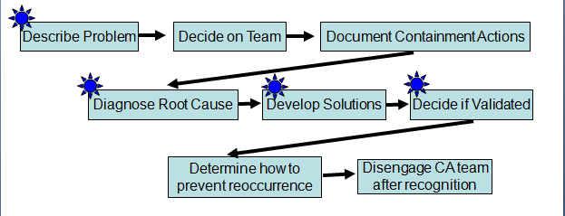

Our project uses a closed-loop corrective action process similar to the Ford Global 8D process. We have modified the process to make specific uses of process performance baselines and models at the points indicated:

我们的项目使用类似于福特全球8D流程的闭环纠正操作流程。我们已经修改了流程，以便在以下几点具体使用流程性能基线和模型:

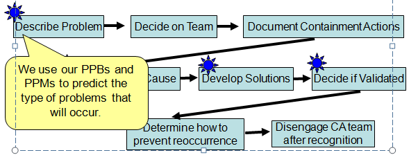

Our project uses a closed-loop corrective action process similar to the Ford Global 8D process. We have modified the process to make specific uses of process performance baselines and models at the points indicated:

我们的项目使用类似于福特全球8D流程的闭环纠正操作流程。我们已经修改了流程，以便在以下几点具体使用流程性能基线和模型:

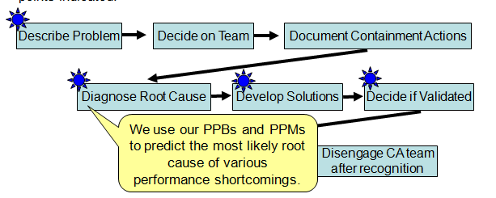

Our project uses a closed-loop corrective action process similar to the Ford Global 8D process. We have modified the process to make specific uses of process performance baselines and models at the points indicated:

我们的项目使用类似于福特全球8D流程的闭环纠正操作流程。我们已经修改了流程，以便在以下几点具体使用流程性能基线和模型:

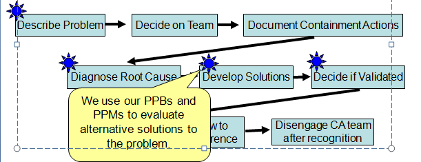

Our project uses a closed-loop corrective action process similar to the Ford Global 8D process. We have modified the process to make specific uses of process performance baselines and models at the points indicated:

我们的项目使用类似于福特全球8D流程的闭环纠正操作流程。我们已经修改了流程，以便在以下几点具体使用流程性能基线和模型:

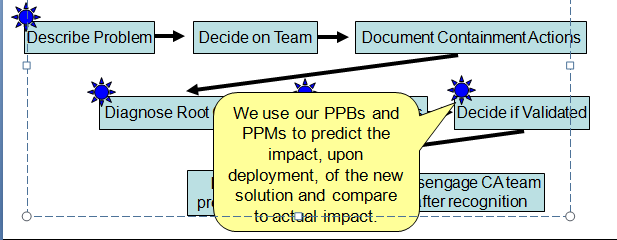
