## Getting R

下载R安装包：下载网址：<https://mirrors.tuna.tsinghua.edu.cn/CRAN/> 页面上面展示的是三种操作系统：Windows、Mac、Linux。根据自己的电脑操作系统选择对应的链接。WIN及Mac下载后正常安装即可

Linux安装：

```         
 配置：sudo vi /etc/apt/sources.list 
 后文件末尾添加 deb https://cloud.r-project.org/bin/linux/ubuntu xenial-cran35/ 
```

```         
 安装：sudo apt-get install r-base
```

### **install R on Win 10/11**

下载R安装包：下载网址：<https://mirrors.tuna.tsinghua.edu.cn/CRAN/> 页面上面展示的是三种操作系统：Windows、Mac、Linux。根据自己的电脑操作系统选择对应的链接。WIN及Mac下载后正常安装即可

下载：

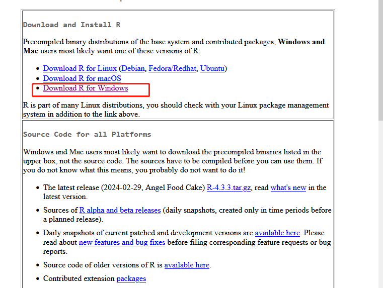

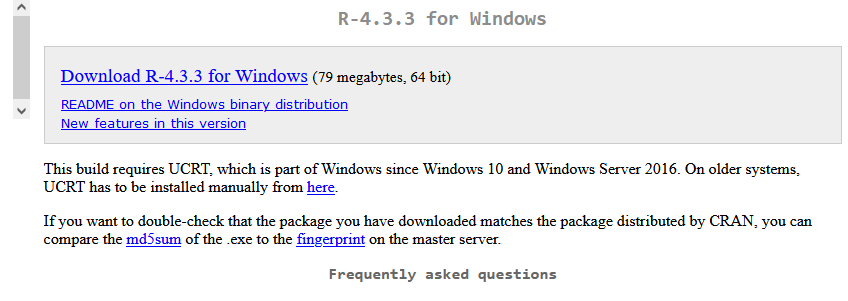

安装：

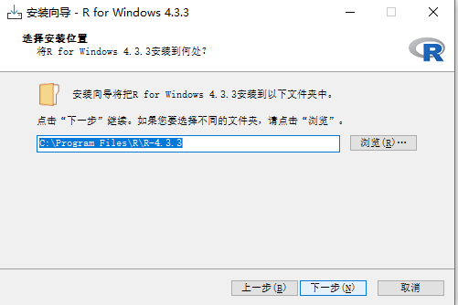

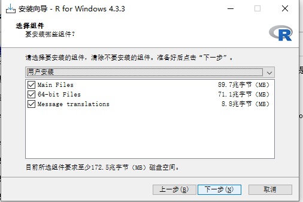

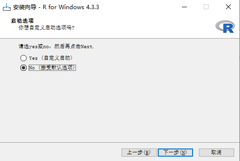

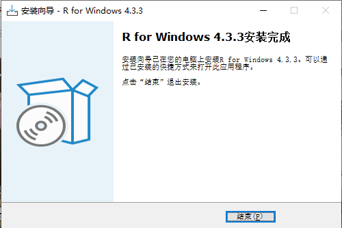

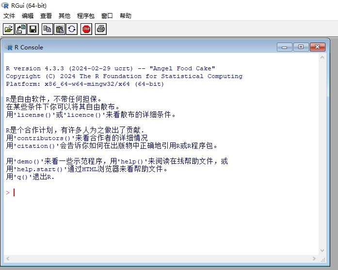

## Getting Rstudio

打开RStudio安装包官网下载网址：<https://www.rstudio.com/products/rstudio/download/> 点击“DOWNLOAD” WIN Mac正常安装即可

配置

```         
 sudo apt-get install gdebi-core  sudo apt-get install libapparmor1 
```

安装

```         
 wget https://download2.rstudio.org/server/bionic/amd64/rstudio-server-1.2.5033-amd64.deb  sudo gdebi rstudio-server-1.2.5033-amd64.deb 
```

### **install R Studio on Win 10/11**

下载：

## 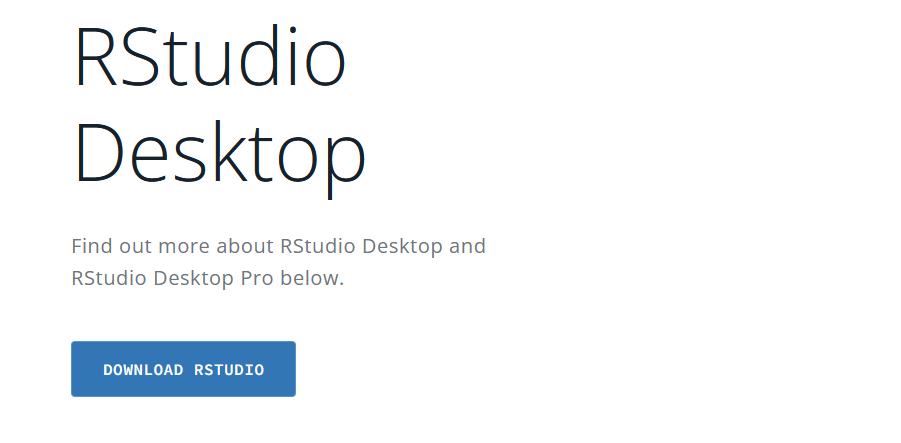

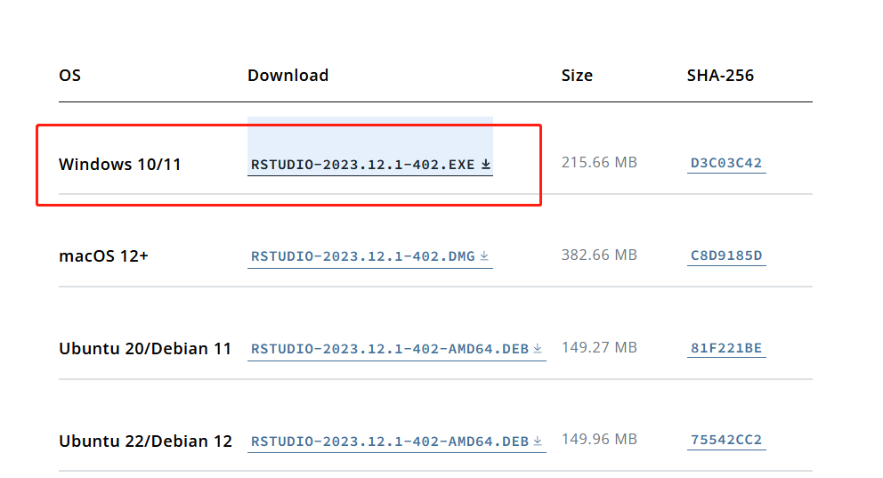\

安装：

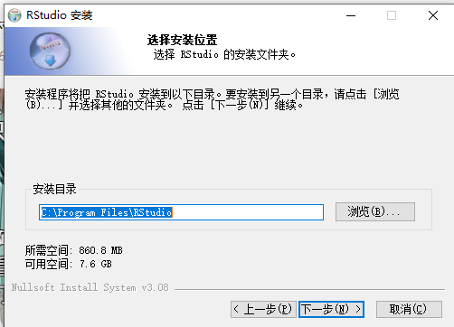

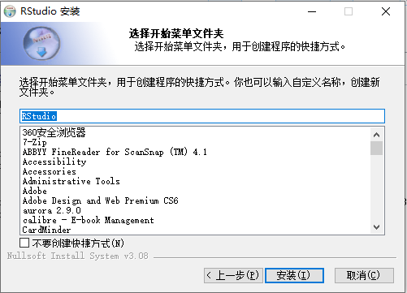

## R session 示范

### **Working directory**

### 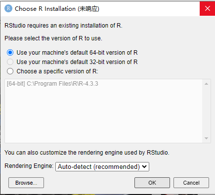

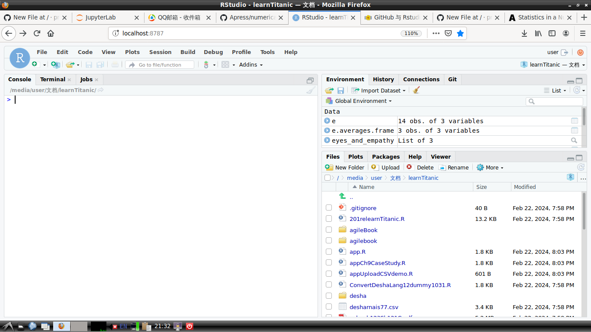

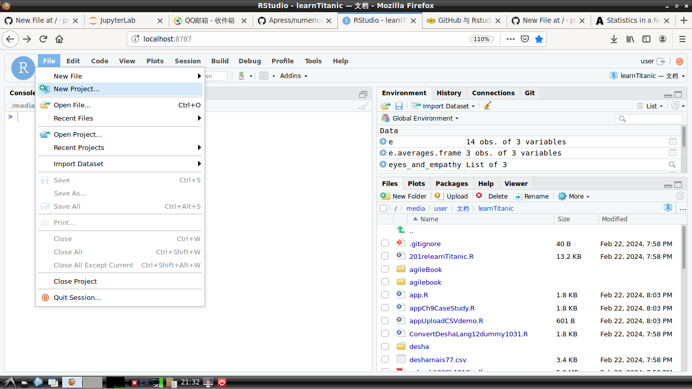

## 
