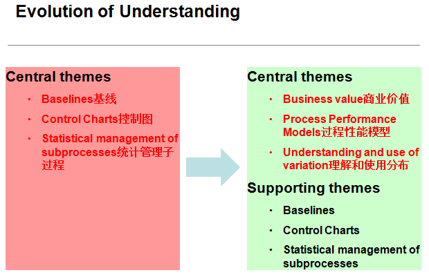
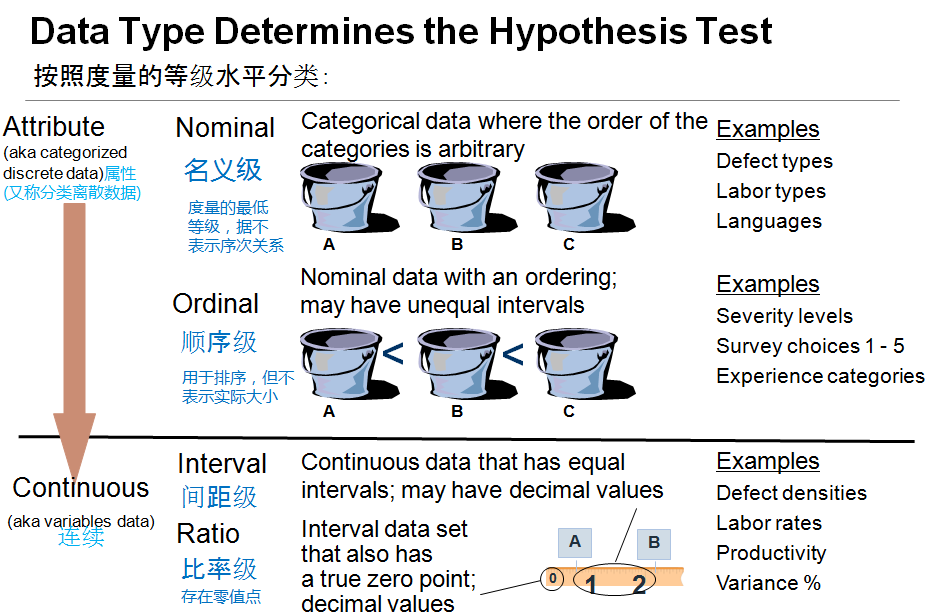
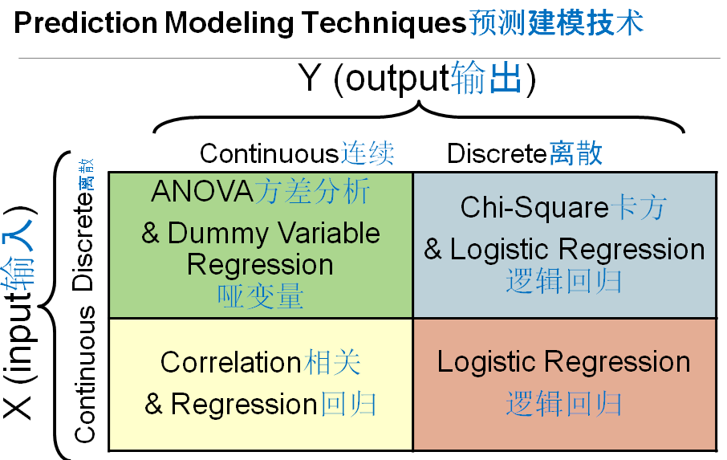
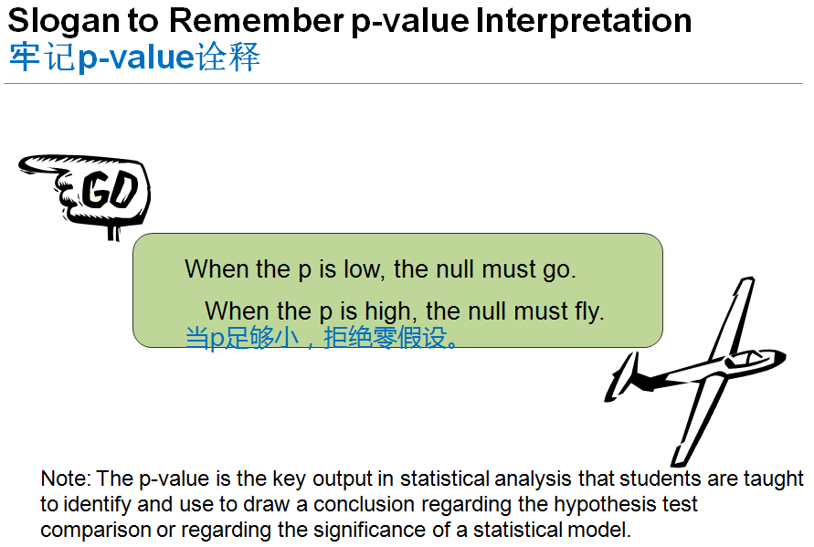
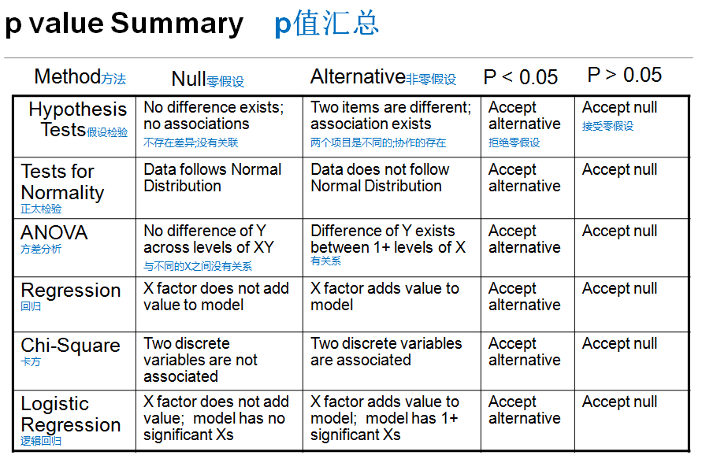

# HMTT 高成熟度辅导

## Evolution of Understanding

从 **错误：**认为控制图，统计数据分析 便是 高成熟度

成为 **正确：**高成熟度最终必须为公司产生价值 ； 结果更可预测 ；预测从单点变为范围

## 高成熟度 案例 V100

美国有一个审查员去日本看一个高成熟度项目，日本擅长画图，他就基本不画图，画了很多基线控制图之类，检查员就问这日本公司，问她你画的这么控制图之类的，最后得出什么结论吗？对公司有什么改进效果？ 对方答不上来，最后就不算五级。 各种的分析图都只是辅助的手段，最重要是有没有价值，对公司的商业目标有什么提升？ OPM的1.3增加的一个过程域，1.1提出要有公司的商业目标，比如我需要怎么盈利啊？怎么提升吧？你这个过程改进，必须要商业目标对得上。做了很多图，对公司没有提升没用。 第二个就是预测模型，我们希望这刚才讲那种概念：不希望用后视镜开车，而是希望可以帮我们更好预计未来。 第三点，不再是个单点而是有个范围的概念，这些需要我们在高成熟度注意。另外以前那种基线、控制图等是有用，但是只是辅助上面那三个点。

# DEFINITIONS 定义

Capable process

-   A process that can satisfy its specified product quality, service quality, and process-performance objectives. (See also “stable process” )

Causal analysis

-   The analysis of outcomes to determine their causes.

common cause of variation

-   The variation of a process that exists because of normal and expected interactions among components of a process. (See also “special cause of variation.”)

\
有能力的过程

能够满足其指定的产品质量、服务质量和过程性能目标的过程。(参见“稳定过程”)

因果分析

-   分析结果以确定其原因。

随机/通常 因素 (Common Cause)

-   由于流程各组成部分之间正常的和预期的交互作用而存在的流程变化。(另见“变异因素(Special Cause)”)

## Hypothesis Testing: To Understand and Compare Performance假设检验:理解和比较性能

Hypothesis testing uses statistical analysis as a formal way of making a comparison and deciding whether or not the difference is significant.

Hypothesis testing consists of comparing a null and an alternative hypothesis:

The null hypothesis states that the members of the comparison are equal; there is no difference (a concrete, default position).

The alternative hypothesis states that there is a difference; it is supported when the null hypothesis is rejected.

The conclusion either rejects or fails to reject the null hypothesis.

Understanding the null and alternative hypotheses is the key to understanding the results of statistical prediction models.

假设检验使用统计分析作为一种正式的方法来进行比较，并决定差异是否显著。

假设检验包括比较零假设和备择假设:

零假设表明，比较的成员是相等的;没有区别(具体的默认位置)。

择一假说认为两者存在差异;当零假设被拒绝时，它得到了支持。

结论要么拒绝原假设，要么没有拒绝原假设。

理解零假设和备择假设是理解统计预测模型的关键。

## Formally Stating a Hypothesis 正式陈述假设

Average productivity equals 100 source lines of code (SLOC) per person week:

Null: Average productivity is equal to 100 SLOC per person week.

Alternative: Average productivity is not equal to 100 SLOC per person week.

A refinement of these hypotheses are as follows:

Null: Average productivity is equal to 100 SLOC per person week.

Alternative: Average productivity is less than 100 SLOC per person week.

Generally, the alternative hypothesis is the difference (e.g. improvement or performance problem) that you seek to learn about.

The null hypothesis holds the conservative position that apparent differences can be explained by chance alone. The phrase “is equal to” will generally appear in the null hypothesis.

平均生产率等于每个人每周100行源代码(SLOC):

零假设:平均生产率等于每个人每周100 SLOC。

备择假设:平均生产率不等于每人每周100 SLOC。

这些假设的改进如下:

零假设:平均生产率等于每个人每周100 SLOC。

备择假设:平均生产率低于每人每周100 SLOC。

一般来说，备择假设是你想要了解的差异(例如改进或性能问题)。

零假设持保守立场，认为表观差异可以仅凭偶然来解释。短语“is equal to”通常出现在零假设中。

## Data Type Determines the Hypothesis Test

## V100

度量一般分两大类：一类是分组的，红黄绿、高中低、12345；另外一种是连续的，连续的第一个名义集就是红黄绿，比如不同类别就是分组，顺序级就是高中低、12345，比如问卷调查？就会分1到10级之类的。下面那还会再分你有没有一个绝对0，比如进度偏差是可以有绝对0比较的，以温度为例，现在北京是15度，深圳是30度，可不可以说？北京的温度是深圳的一半？不能，因为没有绝对0。距离、偏差是有绝对0的，你可以说我是你的两倍三倍是吧，温度只能说深圳的温度比北京高了15度，但都是连续性的。

## Prediction Modeling Techniques

## V100

另外，就是我们分析的话，数据的属于是联系性还是还是分组，有不同的分析方式。 最简单，如果我们是用回归分析的话，X跟y应该是有什么关系？X跟y都是什么类型的数据才可以做回归分析啊？属于刚才的哪一类？ 都必须是连续的数据才可以做回归分析。用个简单的回归分析举例，做个儿童的年龄与身高，这个就是回归分析，两边都是连续的。 但是有些时候我们不是两边都连续，比如x是分组Y是连续，我们就要用到方差分析了，什么是方差分析？ 假如我们收集了很多缺陷，分为7类，不同类型：通用的变量不对、逻辑不对，每个的均值是中间的书，标准差是中间这栋，我们说我们这种，假如我们要建缺陷的基线，从600多个缺陷把所有取个范围或平均值做整个缺陷的基线，可以吗？ 太粗了，应该把可以细分的细分。所以首先呢，我要问自己我这七种缺陷，是否有显著的差异？如果要显著的差异，我就应该拆分开7类不应该总的，如何知道可不可以拆分呢？可以做一个方差分析，方差分析的X是分组，Y就是连续，每个差不多有100个数据，假如这个星星就是那100个数据的均值，这两个就是它的范围，你一眼就看得出来七组很明显的区分，差异显著，如果把这七组不分，而是总的，基线没什么用。有时候没那么简单，就要用方差分析来判断。

## Slogan to Remember p-value Interpretation

## V100

怎么判断呢？就看两个，一个是p值，P值是否小于0.05，小于的话最终拒绝零假定，用个更简单的例子——假设检验来讲，什么是假设检验？假如我们有两个数据，有一些销售分别是A区、B区的，你觉得B区的销售比A好吗？一眼就看得出来嘛，是吧？他最多才到100左右，他最低都差不多100，最高的140，这种的话呢，你不需要做什么假设检验，一眼就看出来B比A好，但假如A跟B是这个分布就难了，有点类似现在是这个，你就需要用一些统计学的方式，帮你去判别这个是否有显著区分？你看过很多杂志都说从我们这个统计学之后，有显著的提升，他最近给我很多数据分析啊，看不出来

## p value Summary

